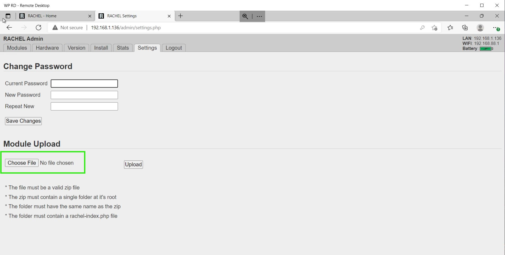

# How to Install RACHEL Modules

To accomplish this process, you will need:
- WP Securebook
- RACHEL Device
- Red (Wi-Fi) Docking Station
- RACHEL Admin Credentials
- Module Zip File to Upload (only needed if Module not in the Listed Modules)

---

# Installing Modules from Listed Modules

To install new modules on RACHEL, follow these steps:
1. Dock the Securebook to the Red Docking Station
2. Make sure to be in range of the RACHEL Wireless Network
3. Power On the Securebook
4. Log in to the jadmin account
5. Open a Web Browser Application (Chrome or Chromium should work)
6. Navigate to RACHEL
7. Click on the "Admin" button on the top right

8. Enter the RACHEL Admin Username and Password

9. Click on the "Install" Tab

10. Click the Module you want to Install and Press the Download Button

Once that Module finishes downloading, it is available on the RACHEL Homepage to use.

---

# Installing Modules from Zip Module Files

To install new modules from Zip Files on RACHEL, follow these steps:
1. Dock the Securebook to the Red Docking Station
2. Make sure to be in range of the RACHEL Wireless Network
3. Power On the Securebook
4. Log in to the jadmin account
5. Open a Web Browser Application (Chrome or Chromium should work)
6. Navigate to RACHEL
7. Click on the "Admin" button on the top right

8. Enter the RACHEL Admin Username and Password

9. Click on the "Settings" Tab

10. Click on the Choose File Button

11. Select the Zip Module File from the File Explorer

Once that Module finishes Downloading, it is available on the RACHEL homepage to use.

---