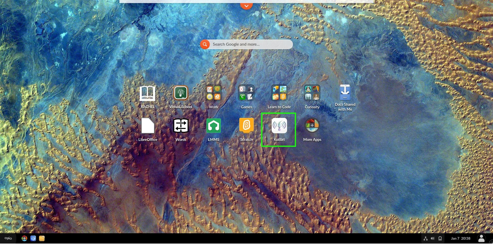
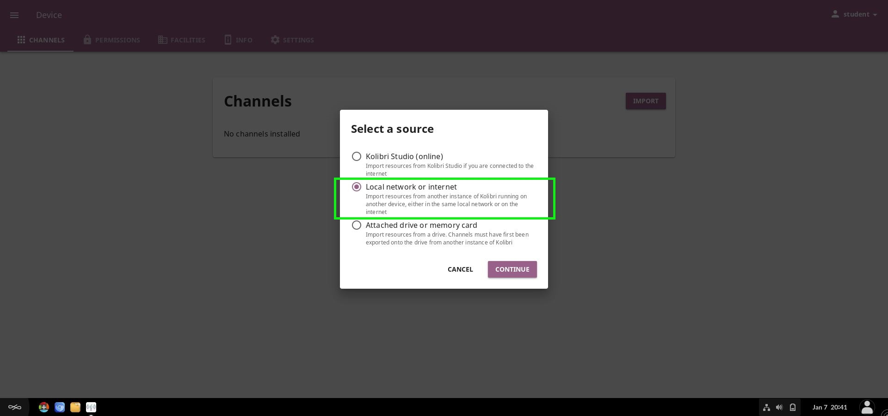
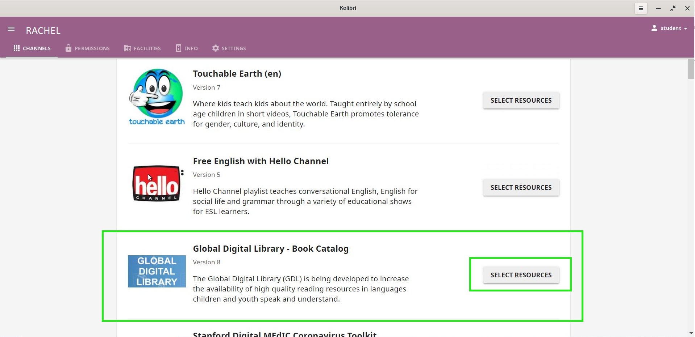
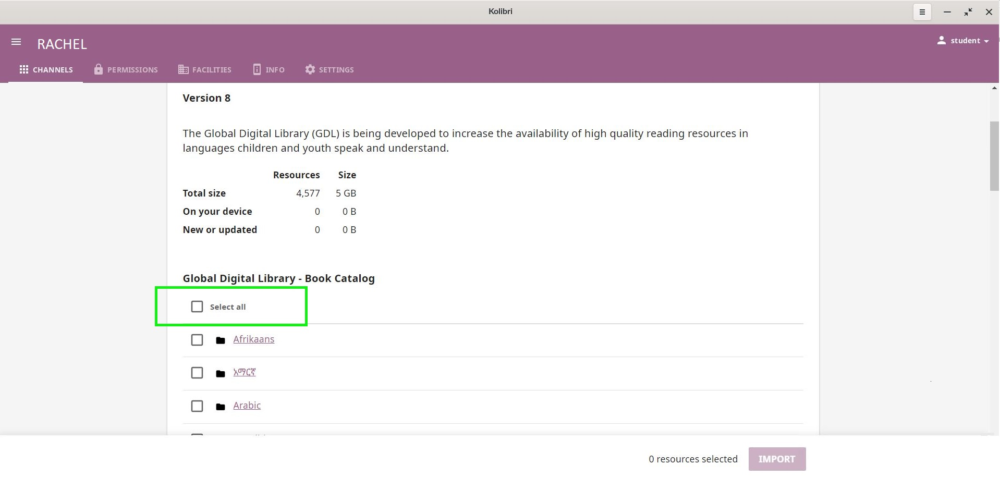
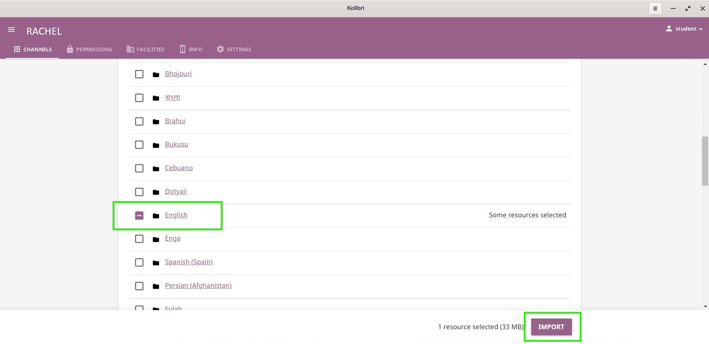
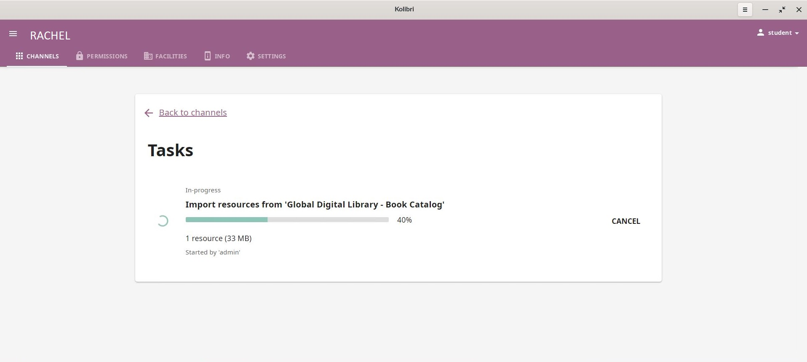
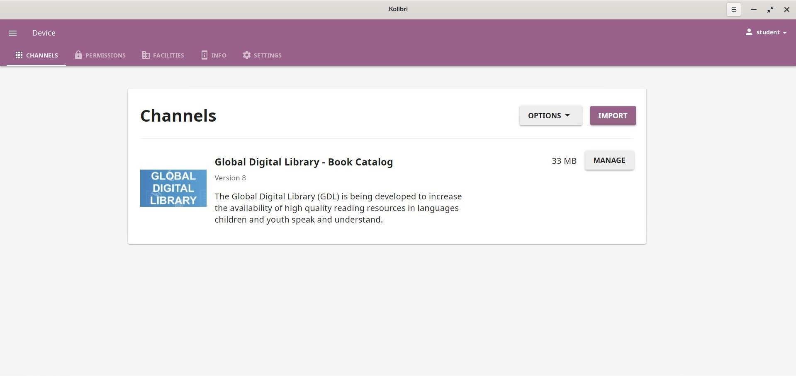

# How to Sync Kolibri Channel From RACHEL (Student's Guide)

To accomplish this process, you will need:
- WP Securebook
- Red (WiFi) Docking Station
- RACHEL Device

---

To sync the content of an updated Kolibri Channel from RACHEL, follow these steps:

1. Dock the Securebook to the Red Docking Station
2. Power On the Securebook
3. Log into a Student account
4. Click the Kolibri Application icon on the desktop to open Kolibri

5. Log into the Kolibri Student Account (If Necessary)
8. Click the "Import" button

9.  Select the "Local Network or internet" option

11. Select the "RACHEL" option
11. Click the "Select Resources" button on the channel you wish to sync (We'll use Digital Library for the Example)

12. Select the "Select All" checkbox (or just the specific checkboxes for choice modules) then click the "IMPORT" button

The channel will begin downloading the new content.

Once the channel finishes downloading the new content from RACHEL it will be available in the Kolibri  Channels Tab.

---
