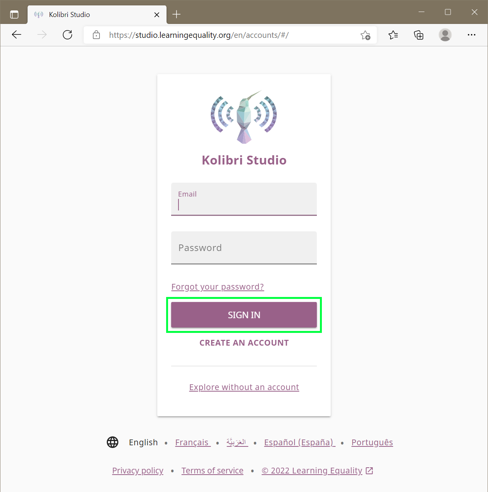
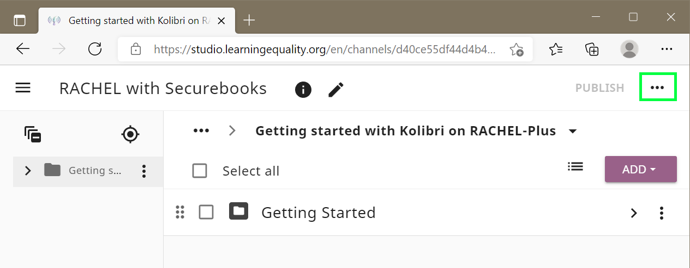
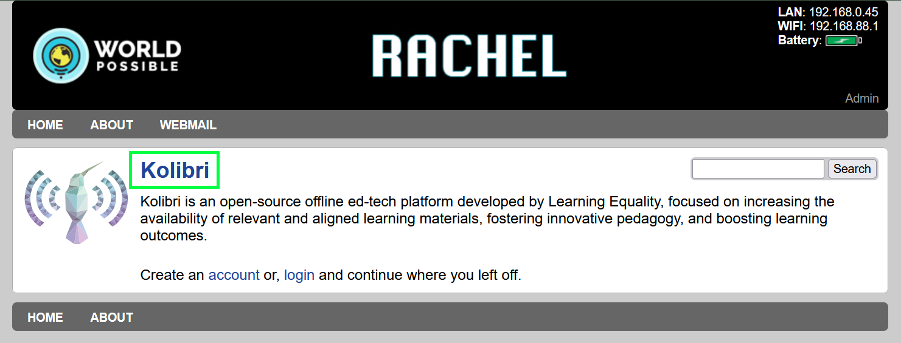
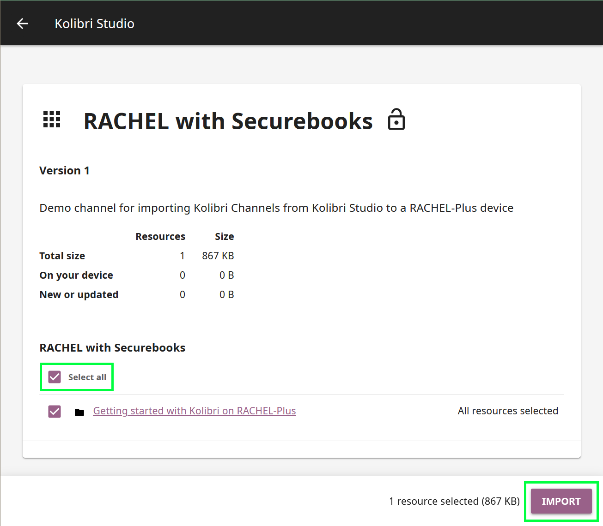

# Importing Custom Kolibri Channels to RACHEL

This tutorial will guide you through importing custom made Kolibri Studio channels to Kolibei on your RACHEL-Plus device.

---

## Prerequisites

To accomplish this process, you will need:
- A PC or Mobile device
- A Published Kolibri Studio Channel
- A supported Chrome, Chromium, or Edge browser
- A RACHEL-Plus device connected to the internet

---

## Finding your channel token

When first publishing your channel on Kolibri Studio you will recieve and email that contains your channel token. If you can't find this token, follow this procedure to get the token again from Kolibri Studio.

1. Open your web browser, navigate to [Kolibri Studio](https://studio.learningequality.org) and sign in to your account

2. Click anywhere on your custom channel to enter it

3. On the top right next to publish, click the "..."

4. Click get token

5. Press the copy button to copy your channel token

6. Your channel token can now be pasted into Kolibri for importing, or a document for saving.

---

## Importing Your Channel to the RACHEL-Plus
These steps will cover importing your Kolibri Channel from Kolibri Studio online

1. Make sure your RACHEL-Plus device is connected to the internet via the left ethernet port

2. Turn on the RACHEL-Plus by pressing the power button on the top for 5 seconds, then releasing when the blue light turns on.

3. Using your PC or mobile device, connect to the RACHEL WIFI hotspot.
4. While connected, navigate to the address [http://192.168.88.1](192.168.88.1) in your web browser

* Please note that If your PC is connected to the same router as your RACHEL-Plus device, you can also navigate to the IP address assigned by your router to the RACHEL-Plus without connecting to the wifi.

5. On the main page of RACHEL, click the Kolibri link on the Kolibri module

6. Enter your admin username at the signin page, then click the NEXT button

7. Enter your admin password and click the SIGN IN button 

8. You should be on the channels page of Kolibri as admin user. Click the IMPORT button.

9. Select Kolibri Studio (online) as your source and press Continue

10. Click the IMPORT WITH TOKEN button

11. Enter your channel token and click CONTINUE and wait for the generating progress bar to complete

12. You will see an overview of your channel's content. Click the "Select All" checkmark to select all of your content. With everything selected, click CONTINUE.

13. Your content will now import. This process will take some time for larger channels. Once complete you will see a screen similar to the following with a completed task. 

14. Click Channels in the top navigation bar

15. Your new channel should now show on this page

You have successfully imported your custom Kolibri channel from Kolibri Studio online to your RACHEL-Plus device. The channel willl now be available for students to browse on the RACHEL-Plus or sync to their securebooks for offline use

---

