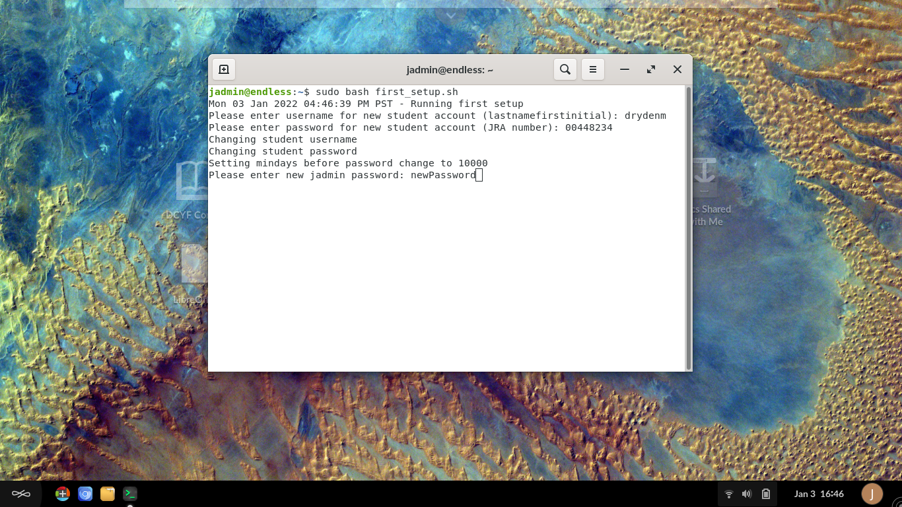
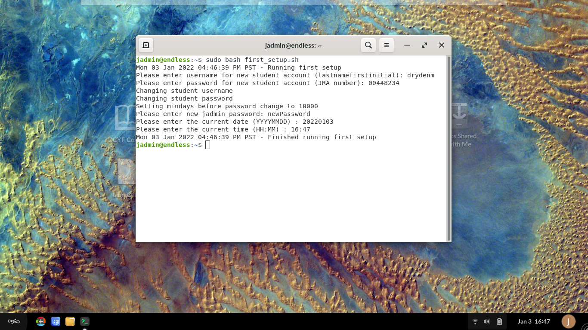

# How to run first_setup.sh

To accomplish this process you will need:
- WP Securebook
- Default jadmin Password
- New Student's Name and Password
- New jadmin Password
- Current Date and Time

*Note: Double Check all information entered during this script as it should only be run once.* 

---

To complete the First Setup process, follow these steps:

1. Power On the Securebook
2. Login to the jadmin account using the default password
3. Open the Terminal Application

4. Run the following command:
	`sudo bash first_setup.sh`
5. Follow the On-Screen prompts:
	- Enter the New Student Account Name
	- Enter the New Student Account Password

	- Enter the New jadmin Account Password

	- Enter the Current Date (YYYYMMDD)
	- Enter the Current Time (HH:MM) in 24 Hour format

*Note: Once you have entered all the information, the script should conclude.*

6. Once the script concludes, close the Terminal Application.

---

In the event that information is incorrect when entered or was incorrectly entered, refer to the Changing Setup Values Document for more details on methods and commands to use to correct the information mis-entered.