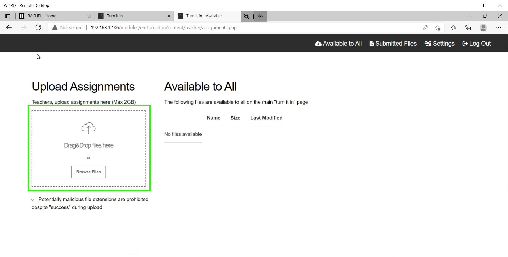
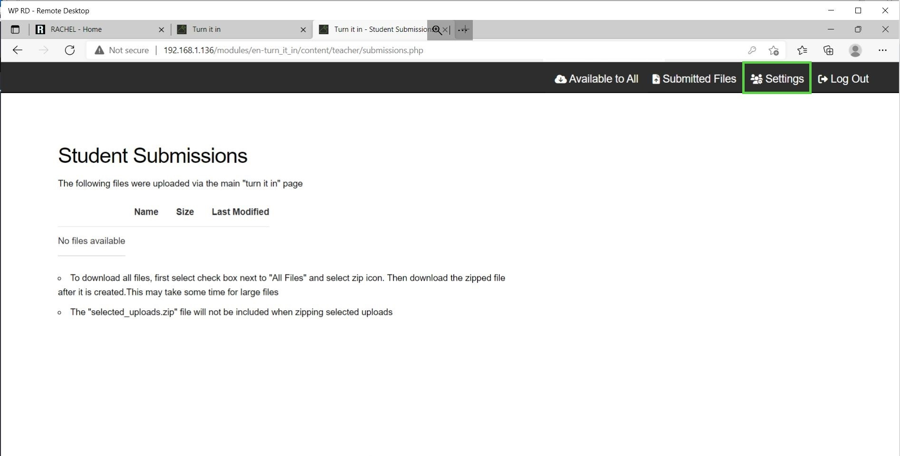

# How to use Turn It In!

To accomplish this process, you will need:
 - WP Securebook
 - Red (Wi-Fi) Securebook Docking Station

---

Turn It In! is a RACHEL module that allows teachers to upload content that can be downloaded by students and it also allows students to upload files for the teacher to collect. 

## Uploading Assignments as Teacher

To accomplish this process as the Teacher, you will also need:
- Turn It In! Teacher Credentials
- Assignments to Upload

To upload a file to Turn It In!, follow these steps:
1. Power On the Securebook with it Docked on a Red Docking Station
2. Open a Web Browser Application (Chrome or Chromium should work)
3. Navigate to RACHEL
4. Select the Turn It In! Module

5. Click the "Teacher Login" button in the top right

6. Enter the Teacher Name and Password and click the Log In Button

7. Click on the "Available To All" button in the top right

8. To Upload a file, Drag and Drop the file into the dotted box or click the "Browse Files" button and select the file from the File Explorer.

9. When the file is done uploading to Turn It In! it will appear in the Available to All section and will now be accessible for all students to download.

Repeat this process for all files that you wish for students to be able to access and download from Turn It In!

---

## Downloading Submitted Assignments as Teacher

To accomplish this process as the Teacher, you will also need:
- Turn It In! Teacher Credentials

To download student submissions from Turn It In!, follow these steps:
1. Power On the Securebook with it Docked on a Red Docking Station
2. Open a Web Browser Application (Chrome or Chromium should work)
3. Navigate to RACHEL
4. Select the Turn It In! Module

5. Click the "Teacher Login" button in the top right

6. Enter the Teacher Name and Password and click the Log In Button

7. To download a file that a student has submitted, click the download button to the right of the file's name, size, and modified date.

*Note: Clicking the trashcan icon next to the download button will delete the file from Turn It In!*

8. Alternatively, to download all the files that students have submitted, click and check the checkbox on the All Files option then click the All Files download button.

*Note: Clicking the trashcan icon next to the download button will delete all the files from Turn It In!*

Once the file finishes downloading, it should be available for you to view and edit wherever your downloads are saved. If you downloaded the files using the All Files option then the files will be compressed into a zip folder before downloading and will need to be unzipped before you are able to view and edit them.

---

## Changing the Login Password

To accomplish this process as a Teacher, you will also need:
- Turn It In! Teacher Credentials
- Teacher's New Password

To change your password as a Teacher on Turn It In!, follow these steps:
1. Power On the Securebook with it Docked on a Red Docking Station
2. Open a Web Browser Application (Chrome or Chromium should work)
3. Navigate to RACHEL
4. Select the Turn It In! Module

5. Click the "Teacher Login" button in the top right

6. Enter the Teacher Name and Password and click the Log In Button

7. Click the "Settings" button in the top right

8. Enter the Old Password, and then the new password in both the New Password and Confirm Password fields.

9. Press the Submit button at the bottom and the password will be successfully changed.

---

## Uploading Assignments as Student

To accomplish this process as a Student, you will also need:
- Assignments to Upload

To upload Assignments to the teacher on Turn It In!, follow these steps:
1. Power On the Securebook with it Docked on a Red Docking Station
2. Open a Web Browser Application (Chrome or Chromium should work)
3. Navigate to RACHEL
4. Select the Turn It In! Module

5. To Upload a file, Drag and Drop the file into the dotted box or click the "Browse Files" button and select the file from the File Explorer.

6.  Once the files have finished uploading they will be available for the teacher to download and review. *Note: Once a file is submitted on Turn It In! it can only be deleted from Turn It In! by the Teacher.*

---

## Downloading Assignments as Student

To download any Assignments the Teacher has posted on Turn It In!, follow these steps:
1. Power On the Securebook with it Docked on a Red Docking Station
2. Open a Web Browser Application (Chrome or Chromium should work)
3. Navigate to RACHEL
4. Select the Turn It In! Module

5. At the bottom of the Turn It In! Homepage there is Assignments section that will list all of the Assignments currently made available by the Teacher. Click the download button next to an Assignment's name to begin downloading that Assignment.

Once the download is finished the Assignment should be ready for you to view and edit wherever your downloads are stored.

---

