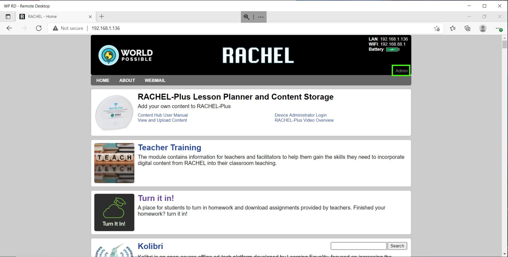
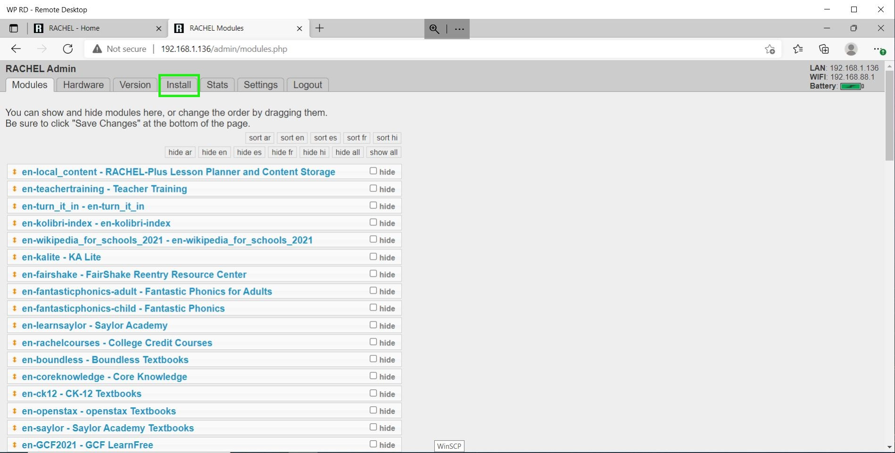
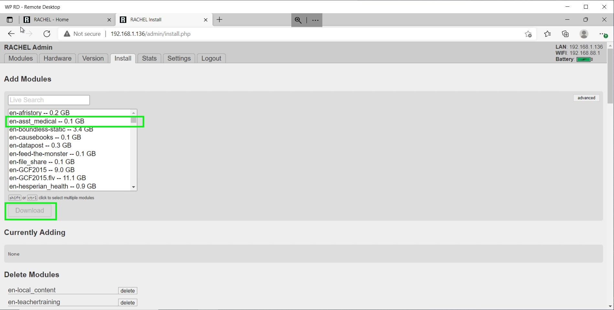
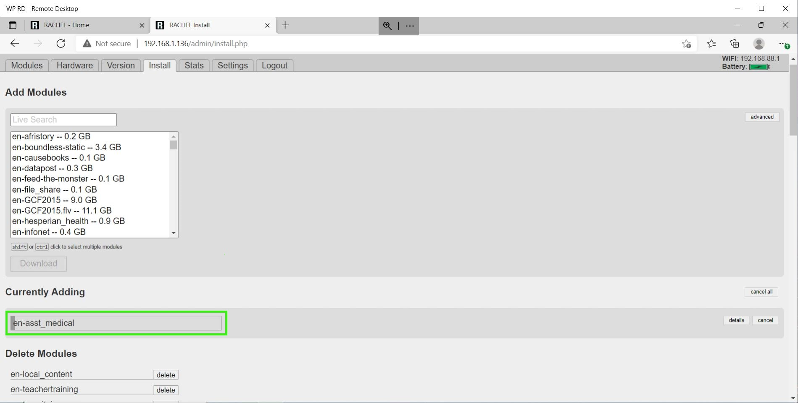
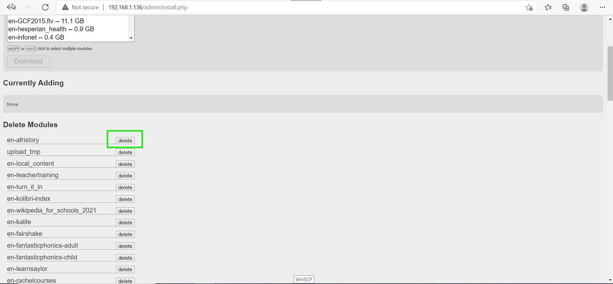
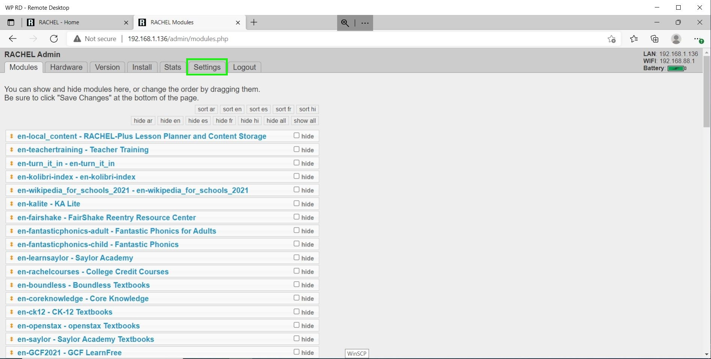
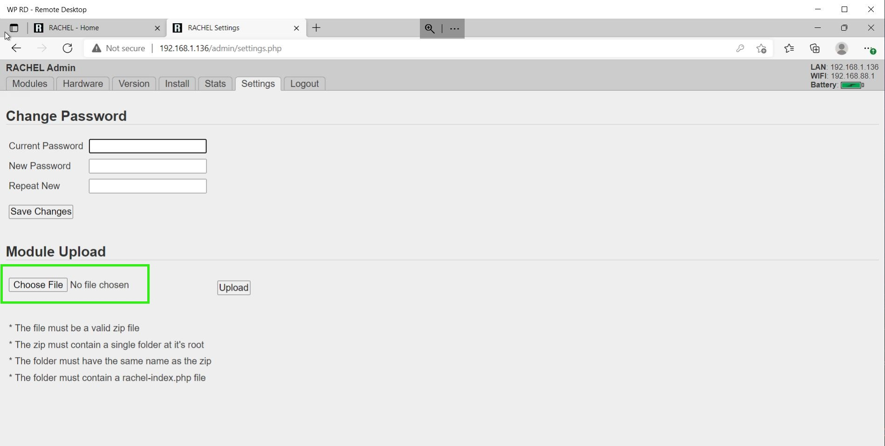
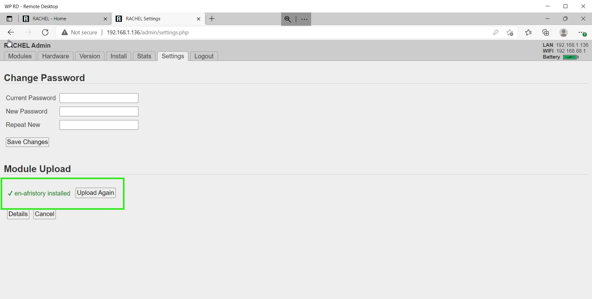

# RACHEL-Plus Guide

## Prerequisites

- WP Securebook
- RACHEL Device
- Red (Wi-Fi) Docking Station
- RACHEL Admin Credentials

---

# Installing and Deleting Modules

## Installing Modules

To install new modules on RACHEL, follow these steps:
1. Dock the Securebook to the Red Docking Station
2. Make sure to be in range of the RACHEL Wireless Network
3. Power On the Securebook
4. Log in to the jadmin account
5. Open a Web Browser Application (Chrome or Chromium should work)
6. Navigate to RACHEL
7. Click on the "Admin" button on the top right

---

---

8. Enter the RACHEL Admin Username and Password

---

---

9. Click on the "Install" Tab

---

---

10. Click the Module you want to Install and Press the Download Button

---

---

Once that Module finishes downloading, it is available on the RACHEL Homepage to use.

---

## Deleting Modules

To Delete existing modules from RACHEL, follow these steps:
1. Dock the Securebook to the Red Docking Station
2. Make sure to be in range of the RACHEL Wireless Network
3. Power On the Securebook
4. Log in to the jadmin account
5. Open a Web Browser Application (Chrome or Chromium should work)
6. Navigate to RACHEL
7. Click on the "Admin" button on the top right

---

---

8. Enter the RACHEL Admin Username and Password

---

---

9. Click on the "Install" Tab

---

---

10. Scroll Down the page a little bit and you will see a section called Delete Modules that lists all of the currently installed modules on RAHCEL. 
11. Click the "delete" button next to the name of a specific module to remove it completely from RACHEL.

---

---

## Installing Modules from Zip Files

*Note: RACHEL Zip Module Files can be found on the [RACHEL Website](https://rachel.worldpossible.org/). This is a great resource because modules can be downloaded from the internet and then stored on USB devices to be installed in areas or places that don't have access to the internet*

To install new modules from Zip Files on RACHEL, follow these steps:
1. Dock the Securebook to the Red Docking Station
2. Make sure to be in range of the RACHEL Wireless Network
3. Power On the Securebook
4. Log in to the jadmin account
5. Open a Web Browser Application (Chrome or Chromium should work)
6. Navigate to RACHEL
7. Click on the "Admin" button on the top right

---

---

8. Enter the RACHEL Admin Username and Password

---

---

9. Click on the "Settings" Tab

---

---

10. Click on the Choose File Button

---

---

11. Select the Zip Module File from the File Explorer

---

---

---

Once that Module finishes Downloading, it is available on the RACHEL homepage to use.

---

# Hiding and Sorting Modules

## Hiding Modules

To hide existing modules in RACHEL, follow these steps:
1. Dock the Securebook to the Red Docking Station
2. Make sure to be in range of the RACHEL Wireless Network
3. Power On the Securebook
4. Log in to the jadmin account
5. Open a Web Browser Application (Chrome or Chromium should work)
6. Navigate to RACHEL
7. Click on the "Admin" button on the top right

---

---

8. Enter the RACHEL Admin Username and Password

---

---

9. Click on the Modules Tab (If you are not already there)

---

---

10. To hide an existing module, click on the checkbox to the right of the module's name, next the the word "hide". Additionally, there are Hiding Tags by language at the top that can hide/show modules by language.
*Note: Similarly, to unhide a module, uncheck the box next to that module's name.*

---

*Note: This will not remove the module from RACHEL, but instead hide it and make it unavailable to the user.*

---

11. Scroll to the bottom of the page and Click the "Save Changes" button.

---

## Sorting Modules

To sort existing modules in RACHEL, follow these steps:
1. Dock the Securebook to the Red Docking Station
2. Make sure to be in range of the RACHEL Wireless Network
3. Power On the Securebook
4. Log in to the jadmin account
5. Open a Web Browser Application (Chrome or Chromium should work)
6. Navigate to RACHEL
7. Click on the "Admin" button on the top right

---

---

8. Enter the RACHEL Admin Username and Password

---

---

9. Click on the Modules Tab (If you are not already there)

---

---

10. On top of the listed modules are Sorting Tags by language, Clicking on any of these will sort the list of existing RACHEL modules which also changes how they are displayed on the RACHEL Homepage.
*Note: Modules can also be reordered in the list manually by dragging and dropping them into chosen places.*

---

---

11. Scroll to the bottom of the page and Click the "Save Changes" button.

---

# Changing Admin Password

---

To change the RACHEL admin password, follow these steps:
1. Dock the Securebook to the Red Docking Station
2. Make sure to be in range of the RACHEL Wireless Network
3. Power On the Securebook
4. Log in to the jadmin account
5. Open a Web Browser Application (Chrome or Chromium should work)
6. Navigate to RACHEL
7. Click on the "Admin" button on the top right

---

---

8. Enter the RACHEL Admin Username and Password

---

---

9. Click on the "Settings" Tab

---

---

10. Enter the Current Password, the desired New Password, and then the New Password again in the "Repeat New" box.

---

---

11. Click the "Save Changes" button to complete the Password change process.

---

# Clearing Statistics

---

