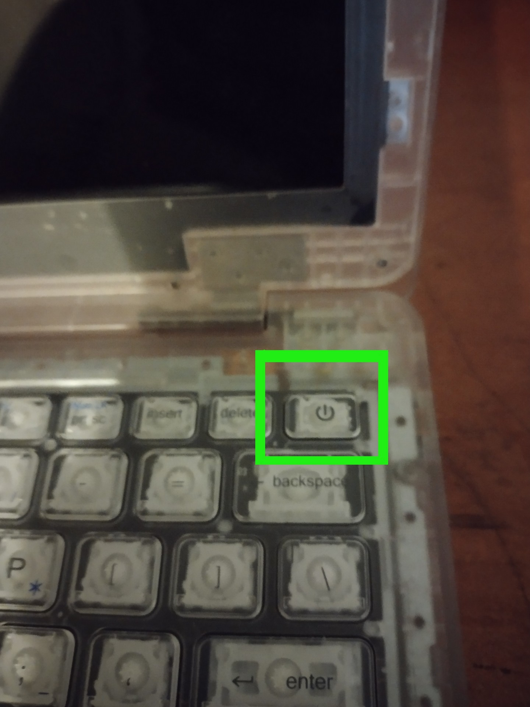
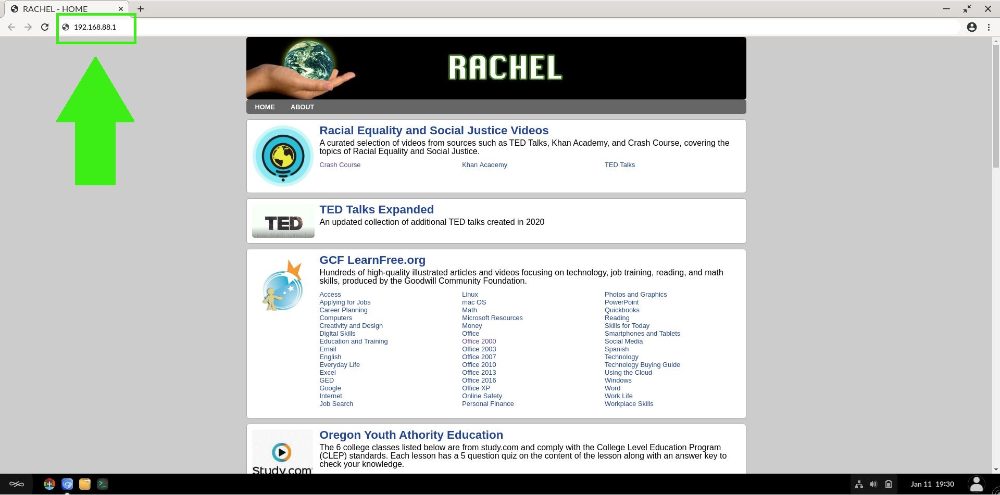
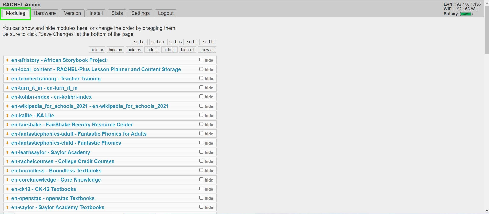
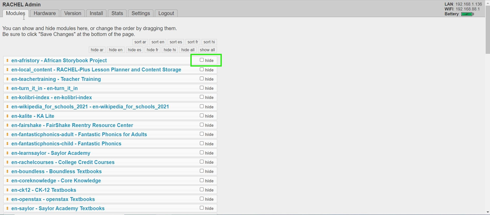
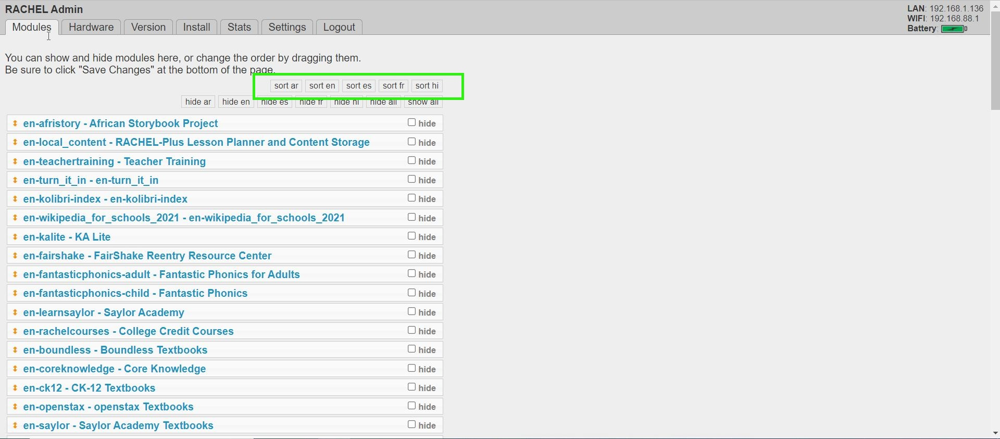
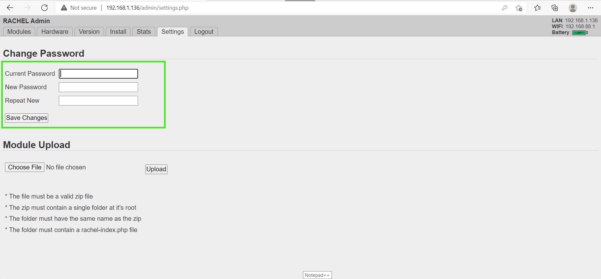

# RACHEL-Plus Guide

## Prerequisites

- WP Securebook
- RACHEL Device
- Red (Wi-Fi) Docking Station
- RACHEL Admin Credentials

---

# RACHEL-Plus Overview
This guide will walk you through using your RACHEL-Plus device. Please follow the powering on and off instructions exactly as they are important to maintain a working device. 

## Powering on Your RACHEL-Plus

1. To safely power on the RACHEL-Plus device, please press the the Power button on the top for 5 seconds. Release when you see the blue lights

---

---

2. With the blue lights visible, your RACHEL-Plus is now powered on

---

---

## Powering off Your RACHEL-Plus

1. To safely turn off the RACHEL-Plus device, please press the the Power button once, then release.

---

---

2. Once the blue lights turn off, your RACHEL-Plus is powered off

---

---

## Maintaining your RACHEL-Plus' Battery

- The RACHEL-Plus should never be continually plugged in and charging for over 24 hours
  - Doing so will quickly ruin the battery inside
- If being constantly plugged in to the charger is your prefered method of operating the RACHEL-Plus:
  - It is strongly advised that you remove the battery from the RACHEL-Plus device entirely

To Discharge the RACHEL-Plus battery:
1. Simply unplug it from the charger after it finishes charging
2. Utilize it as normal until the device needs to be charged again

---

# Connecting to RACHEL-Plus

To connect to your RACHEL-Plus device, follow these steps:
1. Dock the Securebook to the Red Docking Station

---

---

2. Make sure to be in range of the RACHEL Wireless Network
3. Power On the Securebook

---

---

4. Log in to the jadmin account

---

---

5. Open a Web Browser Application (Chrome or Chromium should work)
6. Navigate to RACHEL by entering 192.168.88.1 in the browser addressbar.

---

---

7. Click on the "Admin" button on the top right

---

---

8. Enter the RACHEL Admin Username and Password

---

---

# Installing and Deleting Modules

## Installing Modules

To install new modules on RACHEL, follow these steps:
1. Connect to RACHEL as Admin
2. Click on the "Install" Tab

---

---

3. Click the Module you want to Install and Press the Download Button

---

---

Once that Module finishes downloading, it is available on the RACHEL Homepage to use.

---

## Deleting Modules

To Delete existing modules from RACHEL, follow these steps:
1. Connect to RACHEL as Admin
2. Click on the "Install" Tab

---

---

3. Scroll Down the page a little bit and you will see a section called Delete Modules that lists all of the currently installed modules on RAHCEL. 
4. Click the "delete" button next to the name of a specific module to remove it completely from RACHEL.

---

---

## Installing Modules from Zip Files

*Note: RACHEL Zip Module Files can be found on the [RACHEL Website](https://rachel.worldpossible.org/). This is a great resource because modules can be downloaded from the internet and then stored on USB devices to be installed in areas or places that don't have access to the internet*

To install new modules from Zip Files on RACHEL, follow these steps:
1. Connect to RACHEL as Admin
2. Click on the "Settings" Tab

---

---

3. Click on the Choose File Button

---

---

4. Select the Zip Module File from the File Explorer

---

---

The file will now upload to RACHEL, shown by the progress bar where the Choose File button was located.

---

---

Once that Module finishes Downloading, it is available on the RACHEL homepage to use.

---

# Hiding and Sorting Modules

## Hiding Modules

To hide existing modules in RACHEL, follow these steps:
1. Connect to RACHEL as Admin
2. Click on the Modules Tab (If you are not already there)

---

---

3. To hide an existing module, click on the checkbox to the right of the module's name, next the the word "hide". Additionally, there are Hiding Tags by language at the top that can hide/show modules by language.
*Note: Similarly, to unhide a module, uncheck the box next to that module's name.*

---

*Note: This will not remove the module from RACHEL, but instead hide it and make it unavailable to the user.*

---

4. Scroll to the bottom of the page and Click the "Save Changes" button.

---

## Sorting Modules

To sort existing modules in RACHEL, follow these steps:
1. Connect to RACHEL as Admin
2. Click on the Modules Tab (If you are not already there)

---

---

3. On top of the listed modules are Sorting Tags by language, Clicking on any of these will sort the list of existing RACHEL modules which also changes how they are displayed on the RACHEL Homepage.
*Note: Modules can also be reordered in the list manually by dragging and dropping them into chosen places.*

---

---

4. Scroll to the bottom of the page and Click the "Save Changes" button.

---

# Changing Admin Password

---

To change the RACHEL admin password, follow these steps:
1. Connect to RACHEL as Admin
2. Click on the "Settings" Tab

---

---

3. Enter the Current Password, the desired New Password, and then the New Password again in the "Repeat New" box.

---

---

4. Click the "Save Changes" button to complete the Password change process.

---

