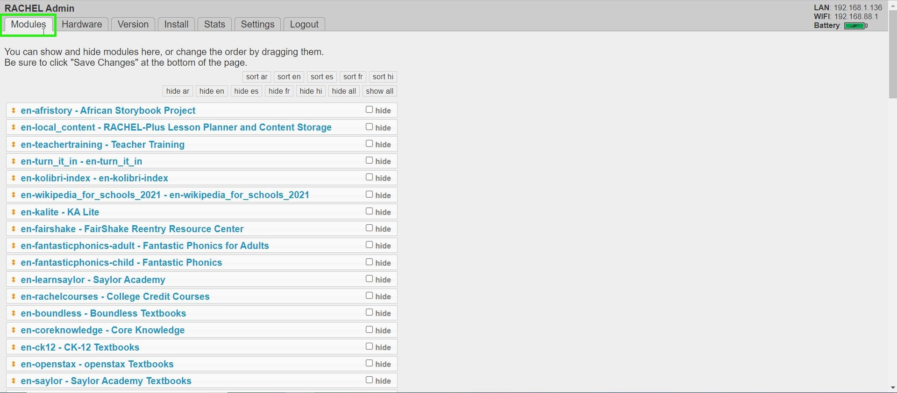
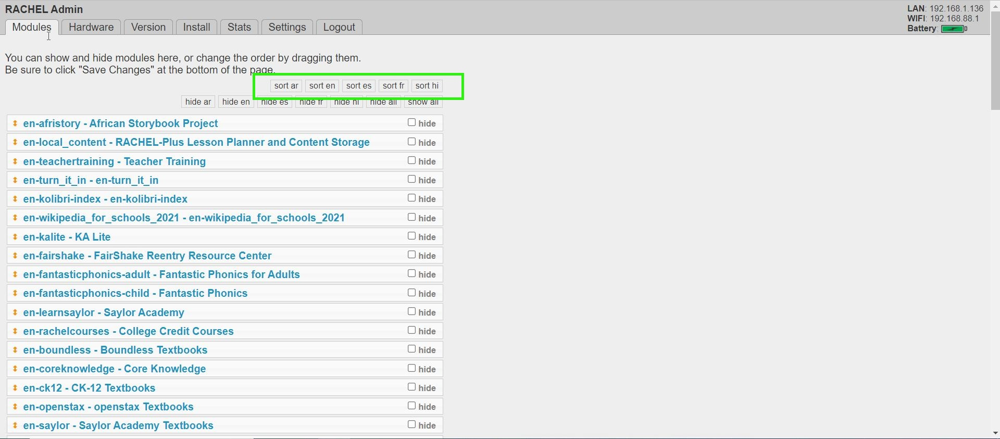

# Hiding and Sorting Modules

## Prerequisites

- WP Securebook
- RACHEL Device
- Red (Wi-Fi) Docking Station
- RACHEL Admin Credentials

---

## Hiding Modules

To hide existing modules in RACHEL, follow these steps:
1. Connect to RACHEL as Admin
2. Click on the Modules Tab (If you are not already there)

---

---

3. To hide an existing module, click on the checkbox to the right of the module's name, next the the word "hide". Additionally, there are Hiding Tags by language at the top that can hide/show modules by language.
*Note: Similarly, to unhide a module, uncheck the box next to that module's name.*

---

*Note: This will not remove the module from RACHEL, but instead hide it and make it unavailable to the user.*

---

4. Scroll to the bottom of the page and Click the "Save Changes" button.

---

## Sorting Modules

To sort existing modules in RACHEL, follow these steps:
1. Connect to RACHEL as Admin
2. Click on the Modules Tab (If you are not already there)

---

---

3. On top of the listed modules are Sorting Tags by language, Clicking on any of these will sort the list of existing RACHEL modules which also changes how they are displayed on the RACHEL Homepage.
*Note: Modules can also be reordered in the list manually by dragging and dropping them into chosen places.*

---

---

4. Scroll to the bottom of the page and Click the "Save Changes" button.

---