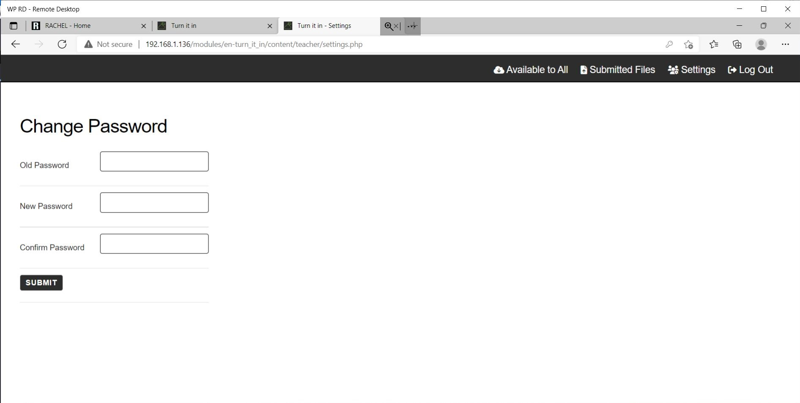

# Changing Login Password

## Prerequisites

To accomplish this process, you will need:
 - WP Securebook
 - Red (Wi-Fi) Securebook Docking Station

---

## Changing the Login Password

To accomplish this process as a Teacher, you will also need:
- Turn It In! Teacher Credentials
- Teacher's New Password

To change your password as a Teacher on Turn It In!, follow these steps:
1. Power On the Securebook with it Docked on a Red Docking Station
2. Log into the jadmin account
3. Open a Web Browser Application (Chrome or Chromium should work)
4. Navigate to RACHEL
5. Select the Turn It In! Module

---

---

6. Click the "Teacher Login" button in the top right

---

---

7. Enter the Teacher Name and Password and click the Log In Button

---

---

8. Click the "Settings" button in the top right

---

---

9. Enter the Old Password, and then the new password in both the New Password and Confirm Password fields.

---

---

10. Press the Submit button at the bottom and the password will be successfully changed.

---