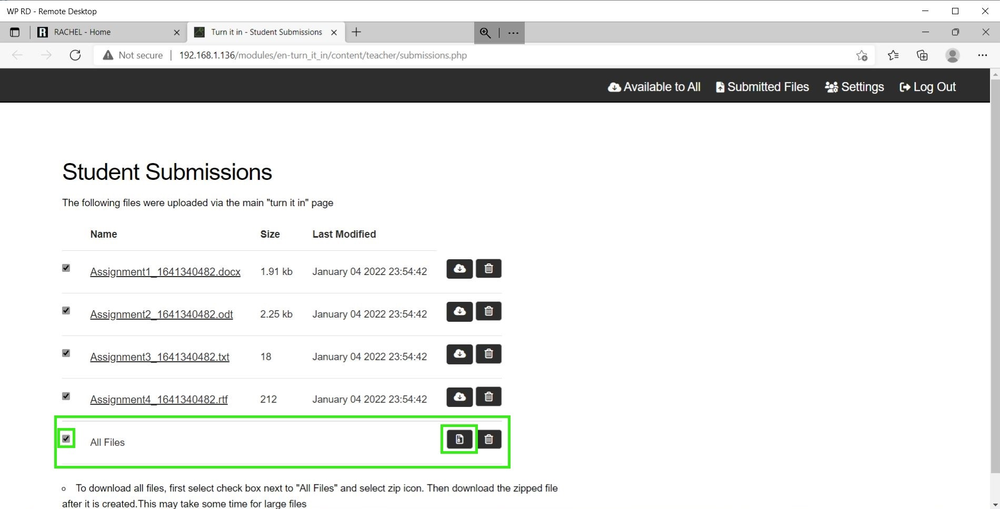

# Downloading Submitted Assignments

## Prerequisites

To accomplish this process, you will need:
 - WP Securebook
 - Red (Wi-Fi) Securebook Docking Station

---

## Downloading Submitted Assignments

To accomplish this process as the Teacher, you will also need:
- Turn It In! Teacher Credentials

To download student submissions from Turn It In!, follow these steps:
1. Power On the Securebook with it Docked on a Red Docking Station
2. Log into the jadmin account
3. Open a Web Browser Application (Chrome or Chromium should work)
4. Navigate to RACHEL
5. Select the Turn It In! Module

---

---

6. Click the "Teacher Login" button in the top right

---

---

7. Enter the Teacher Name and Password and click the Log In Button

---

---

8. To download a file that a student has submitted, click the download button to the right of the file's name, size, and modified date.

---

*Note: Clicking the trashcan icon next to the download button will delete the file from Turn It In!*

---

9. Alternatively, to download all the files that students have submitted, click and check the checkbox on the All Files option then click the All Files download button.

---

*Note: Clicking the trashcan icon next to the download button will delete all the files from Turn It In!*

---

Once the file finishes downloading, it should be available for you to view and edit wherever your downloads are saved. If you downloaded the files using the All Files option then the files will be compressed into a zip folder before downloading and will need to be unzipped before you are able to view and edit them.

---