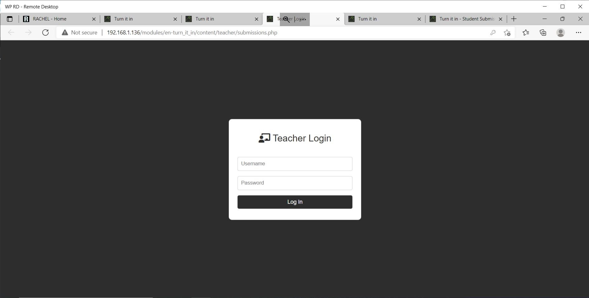
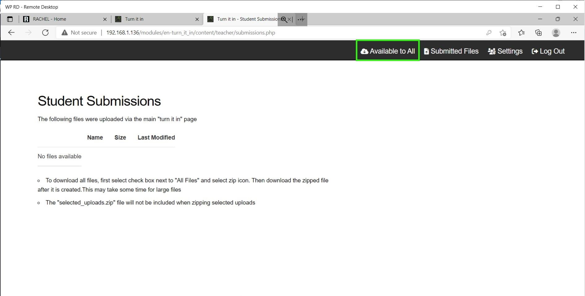
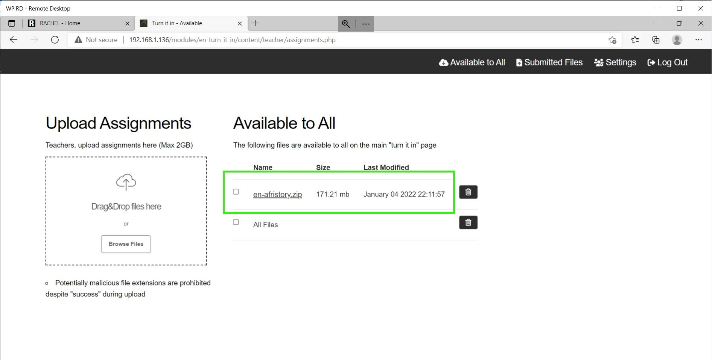

# Uploading Assignments as Teacher

## Prerequisites

To accomplish this process, you will need:
 - WP Securebook
 - Red (Wi-Fi) Securebook Docking Station

---

## Uploading Assignments as Teacher

To accomplish this process as the Teacher, you will also need:
- Turn It In! Teacher Credentials
- Assignments to Upload

To upload a file to Turn It In!, follow these steps:
1. Power On the Securebook with it Docked on a Red Docking Station
2. Log into the jadmin account
3. Open a Web Browser Application (Chrome or Chromium should work)
4. Navigate to RACHEL
5. Select the Turn It In! Module

---

---

5. Click the "Teacher Login" button in the top right

---

---

6. Enter the Teacher Name and Password and click the Log In Button

---

---

7. Click on the "Available To All" button in the top right

---

---

8. To Upload a file, Drag and Drop the file into the dotted box or click the "Browse Files" button and select the file from the File Explorer.

---

---

9. When the file is done uploading to Turn It In! it will appear in the Available to All section and will now be accessible for all students to download.

---

---

Repeat this process for all files that you wish for students to be able to access and download from Turn It In!

---
