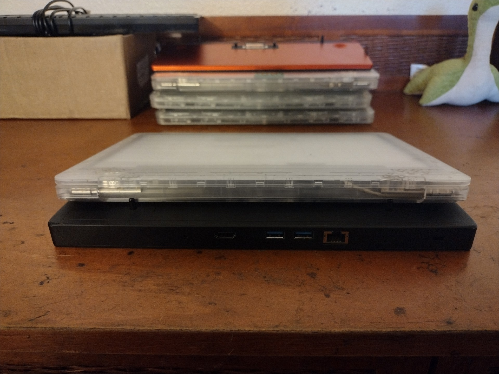
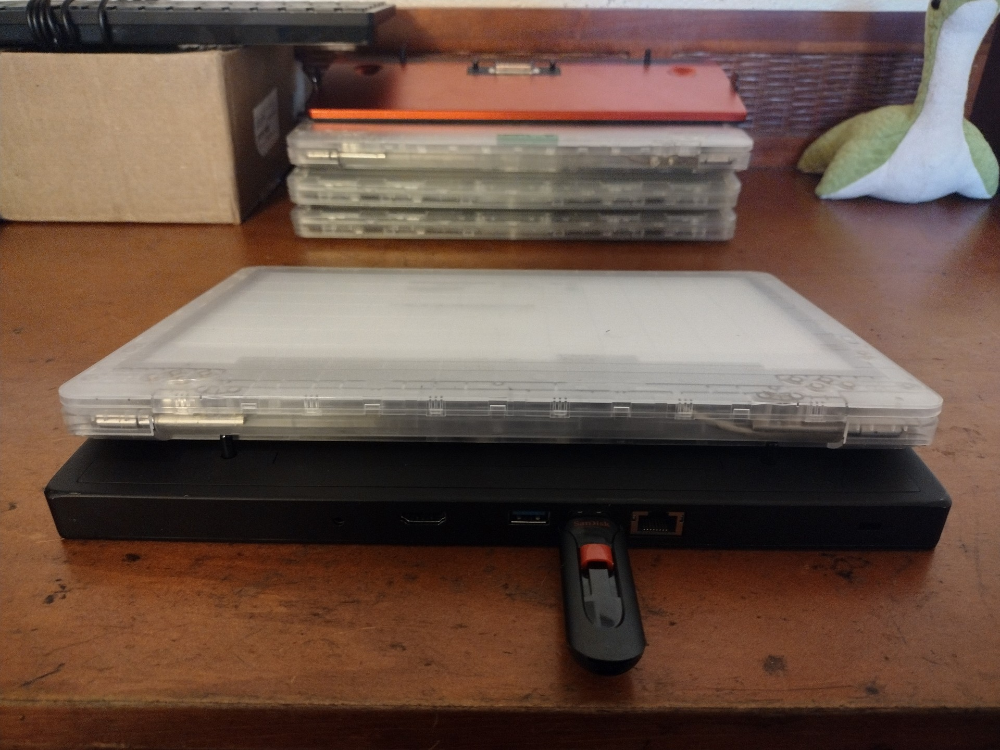
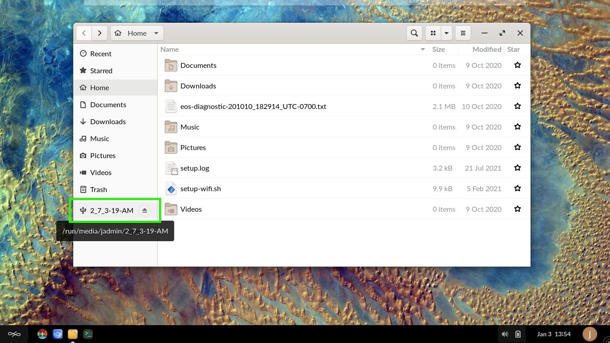

# How to Dock Devices to USB

## Prerequisites
To accomplish this process, you will need:
 - WP Securebook
 - Black (USB) Securebook Docking Station
 - USB Device

---

To Access a USB devices with a Securebook, follow these steps:
1. Power Off the Securebook
2. Dock the Securebook onto the Black Docking Station

---

*Note: If the Securebook is correctly situated on the docking station, A green light will light up on the side. If there is no light, the Securebook could be improperly mounted, powered off, or even be dead (0% power).*

---

3. Power On the Securebook
4. Log in to an account
5. Plug the desired USB device into the Black USB Dock

---

---

6. Open the Document Explorer
7. Select the USB device from the pane on the left

---

---

Users are not limited to using a singular Black Docking Station. Should the need arise, the user can repeat the steps above on an entirely different Black Docking Station and achieve the same results.
*Note*: For best results, make sure the Securebook is Turned Off when docking to a Black Docking Station.