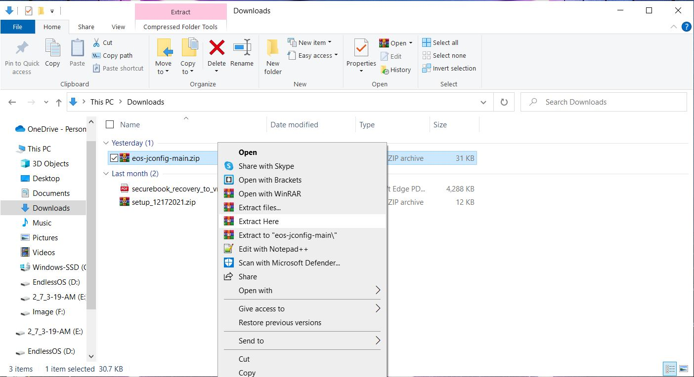
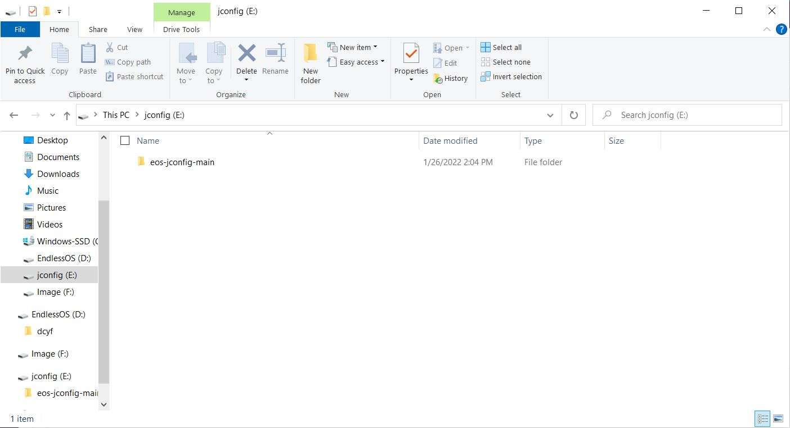
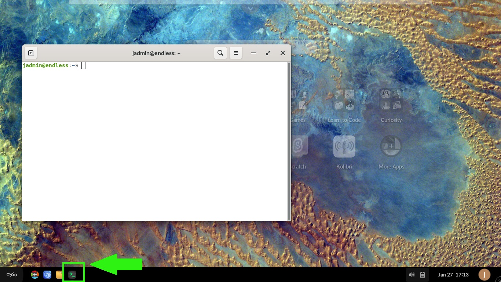
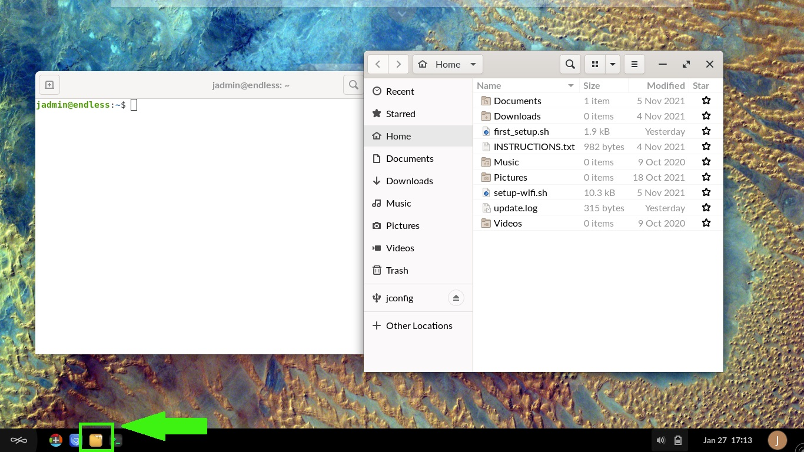
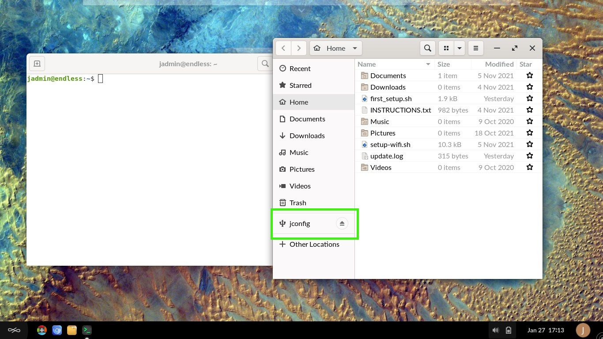
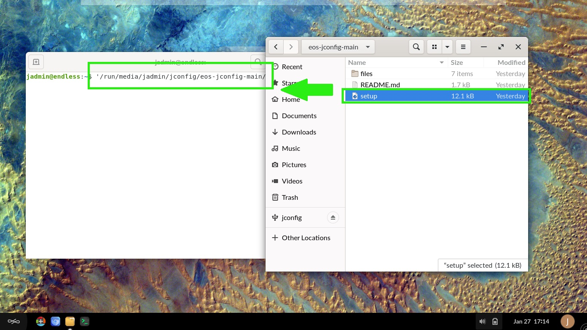
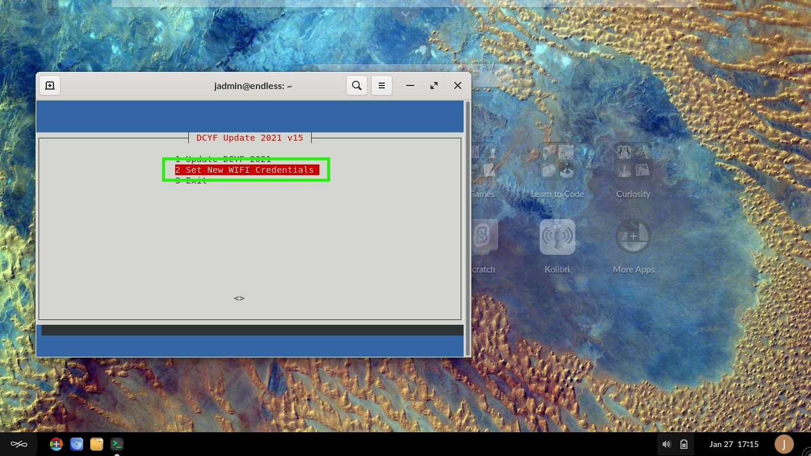
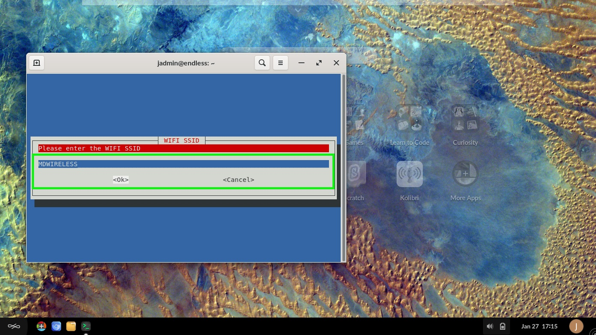
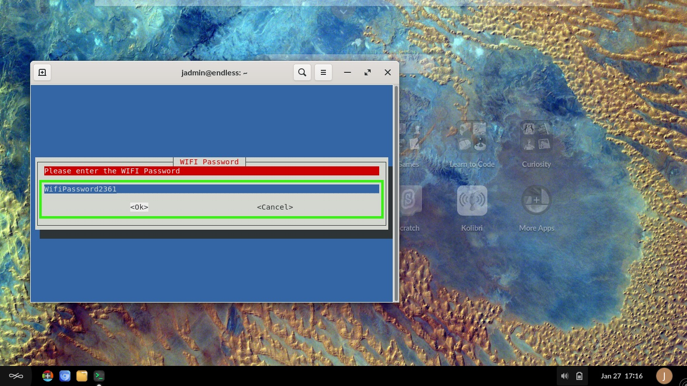
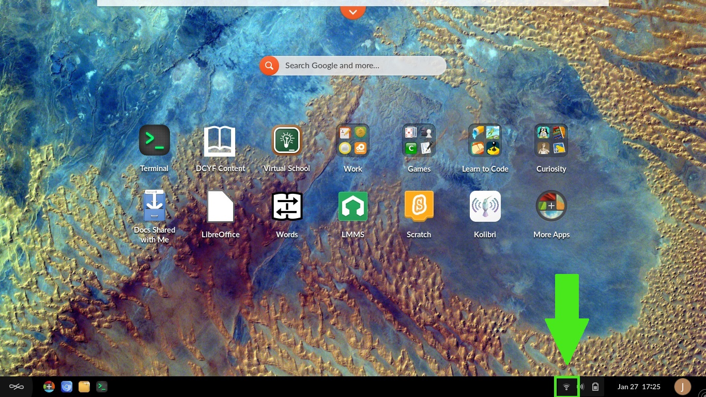

# How to run Jconfig Utility

## Prerequisites

To accomplish this process, you will need:
- WP Securebook
- Black (USB) Docking Station
- Red (Wi-Fi) Docking Station
- USB Device
- Jconfig Utility

---

## Run the Jconfig Utility

To use the Jconfig Utility, follow these steps:
1. Unzip this latest utility

---

---

2. Place the files from the zip on an exFAT USB drive

---

---

3. Boot the securebook with a black docking station
4. Connect the new exFAT USB stick with the new utility on it in the docking station
5. Login with the jadmin account

---

---

6. Open a terminal window

---

---

7. Open a file manager window

---

---

8. Navigate to the new USB

---

---

9. Drag "setup" onto the terminal window

---

---

10. Click the terminal window
11. Press enter with the command in place, making sure no changes were made

---

---

With access to the Jconfig Utility, you now have the ability to run the update script as well as set/change wifi credentials.

---

## How to change wifi credentials

To use the Jconfig Utility to change wifi credentials, follow these steps:
1. Run the Jconfig Utility

---

---

2. Use the arrow key to select "Set New WIFI Credentials" and press ENTER

---

---

3. Enter the SSID, then press ENTER 

---

---

4. Enter the Password, then press ENTER

*Note: Please make sure the network password doesn't use any special characters and only a-z 0-9 characters for best results.*

---

---

5. Press enter to exit any success prompt

---

---

6. Navigate to Exit and press ENTER

---

---

7. Shut the system down
8. Dock to a red WIFI docking station
9. Be in range of the SSID
10. Turn the system on
11. Check that WIFI is properly connected

---

---