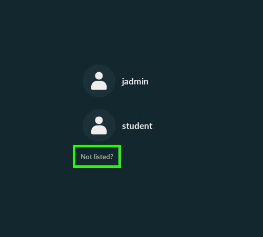
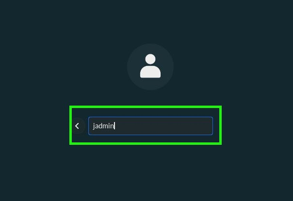
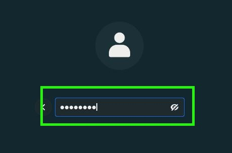

# Process for Jason

## Prerequisites

To accomplish this process, you will need:
- WP Securebook

---

## Logging in

1. Make sure the Securebook is Powered Off
2. Dock to a Red (Wi-Fi) Docking Station
3. Power On the Securebook
4. At the Login Screen, select the "Not Listed?" option

---

---

5. Type "jadmin" into the input bar and hit Enter

---

---

6. Type "justice1" in the input bar and hit Enter

---

---
