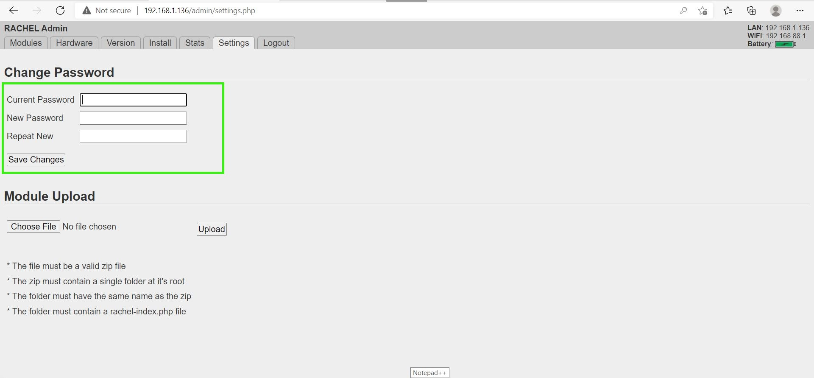

# RACHEL-Plus Guide

## Prerequisites

- WP Securebook
- RACHEL Device
- Red (Wi-Fi) Docking Station
- RACHEL Admin Credentials

---
# RACHEL-Plus Overview
This guide will walk you through using your RACHEL-Plus device. Please follow the powering on and off instructions exactly as they are important to maintain a working device. 

---

# Connect to RACHEL

[Link to RG_ConnectToRACHEL]

---

# Adding and Deleting Modules

[Link to RG_AddDeleteModules]

---

# Hiding and Sorting Modules

[Link to RG_HidingSortingModules]

---

# RACHEL Power Guides

[Link to RG_RachelPowerGuide]

---

# Changing Admin Password

---

To change the RACHEL admin password, follow these steps:
1. Connect to RACHEL as Admin
2. Click on the "Settings" Tab

---

---

3. Enter the Current Password, the desired New Password, and then the New Password again in the "Repeat New" box.

---

---

4. Click the "Save Changes" button to complete the Password change process.

---

