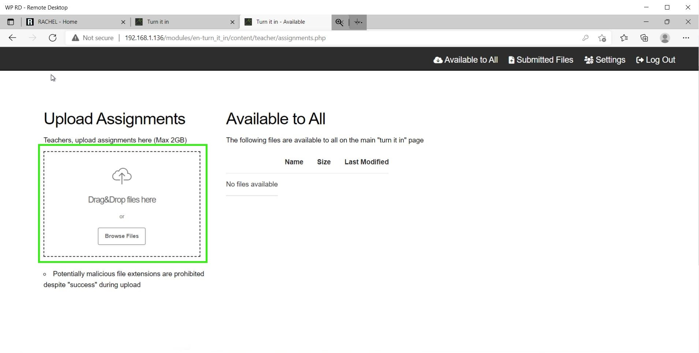
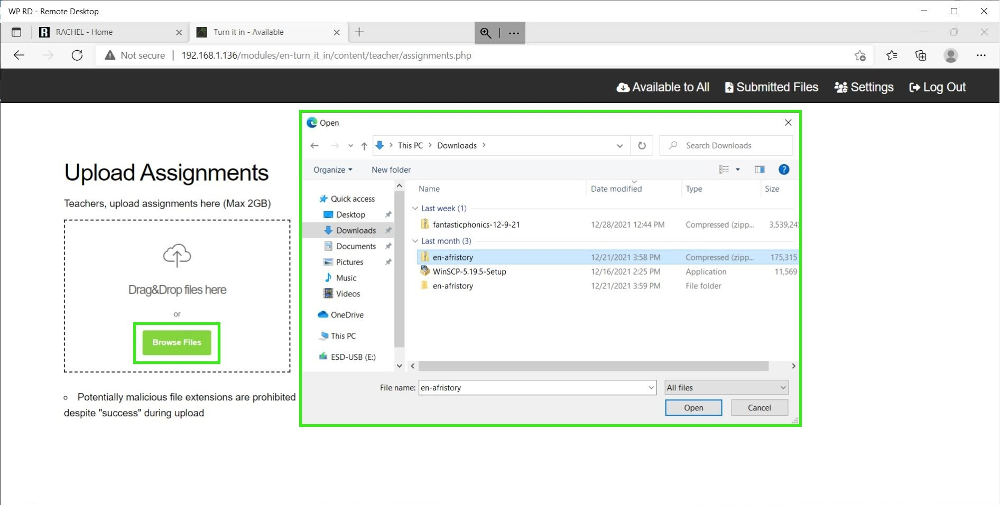
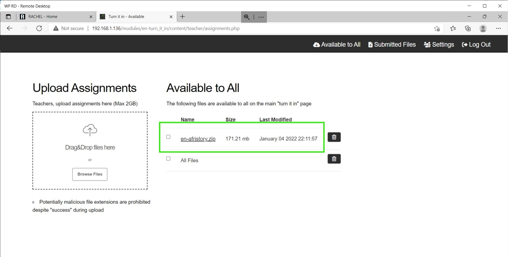

# Uploading Assignments as Teacher

## Prerequisites

To accomplish this process, you will need:
- WP Securebook
- Red (Wi-Fi) Securebook Docking Station
- Turn It In! Teacher Credentials
- Assignments to Upload

---

To upload a file to Turn It In!, follow these steps:
1. Log into Turn It In! as Teacher
2. Click on the "Available To All" button in the top right

---

---

3. To Upload a file, Drag and Drop the file into the dotted box or click the "Browse Files" button and select the file from the File Explorer.

---

---

4. When the file is done uploading to Turn It In! it will appear in the Available to All section and will now be accessible for all students to download.

---

---

Repeat this process for all files that you wish for students to be able to access and download from Turn It In!

---