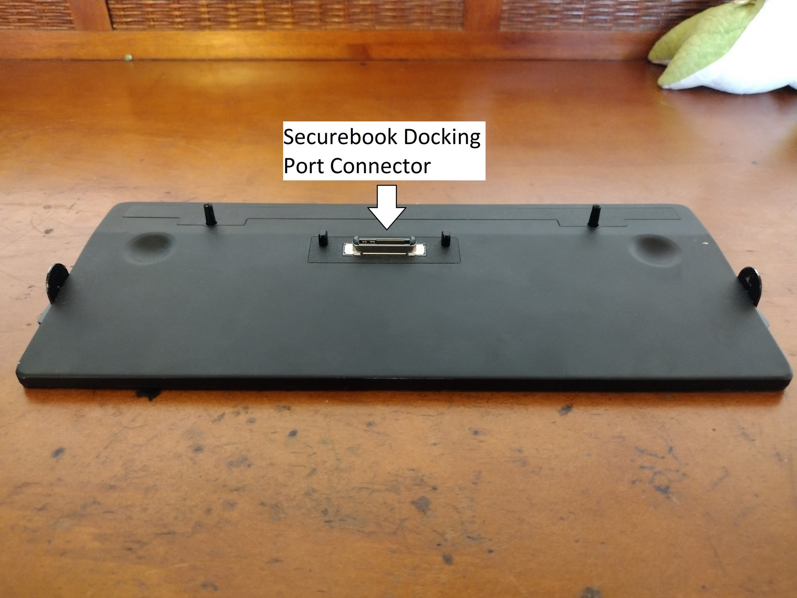
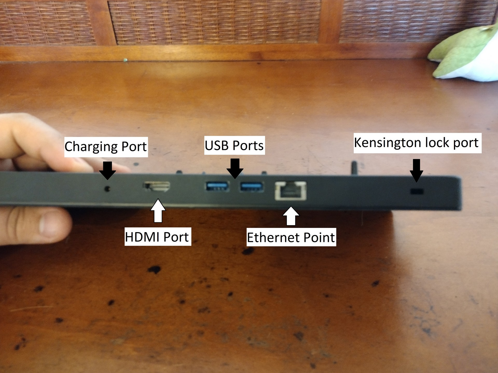
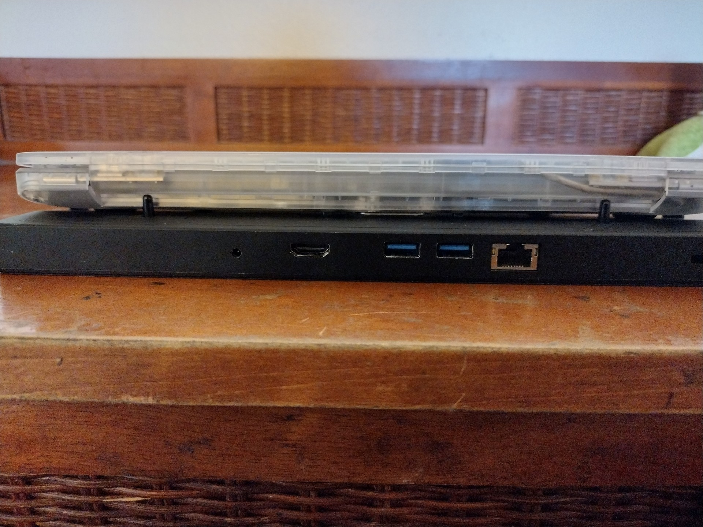
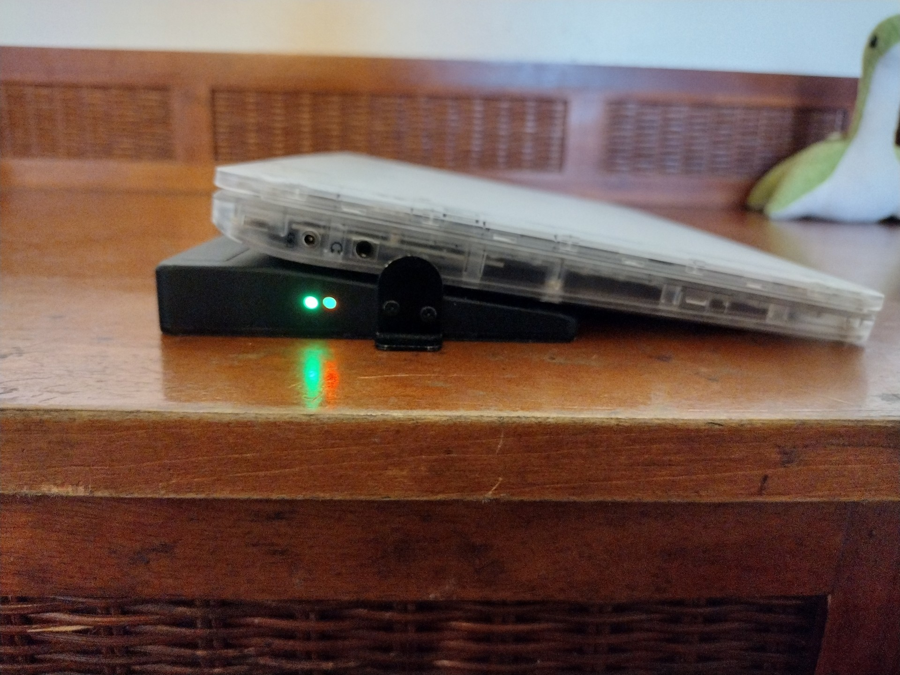
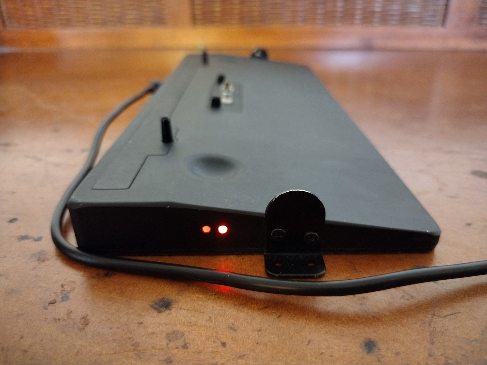
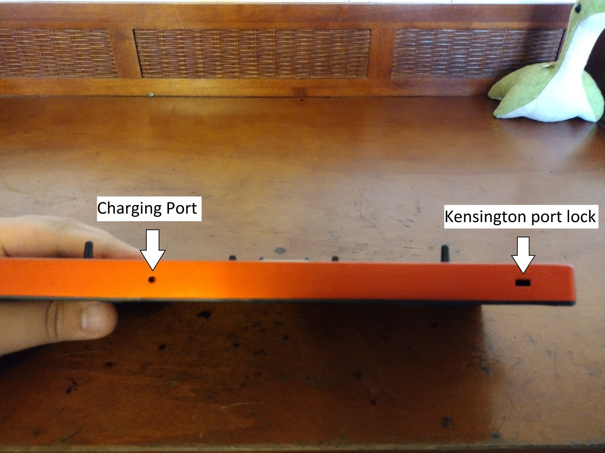
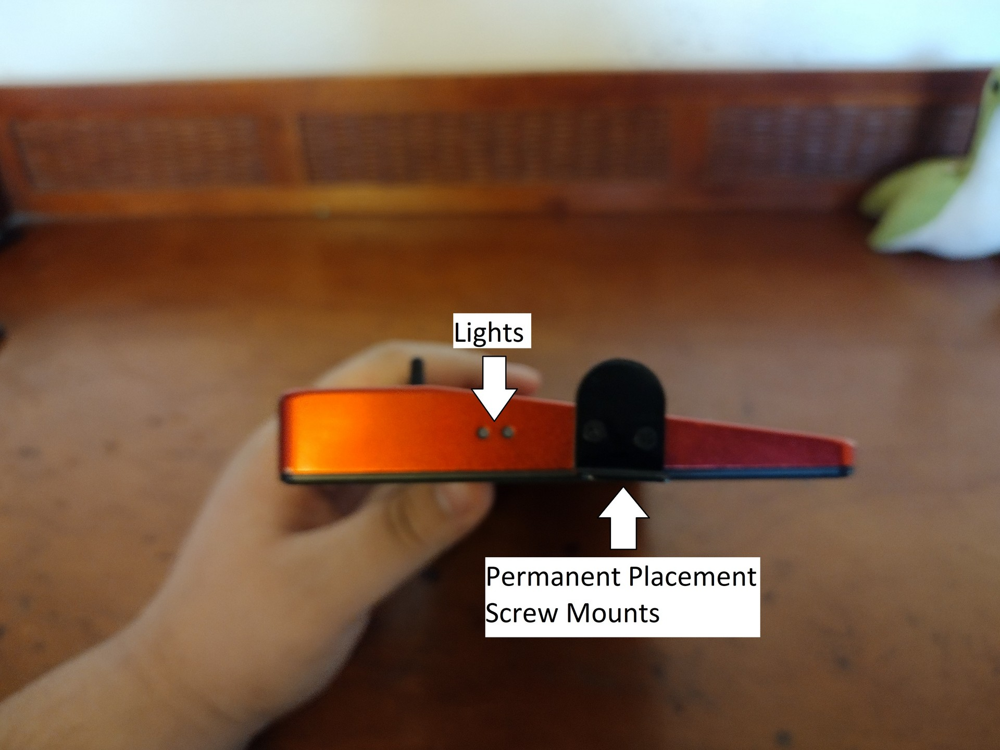
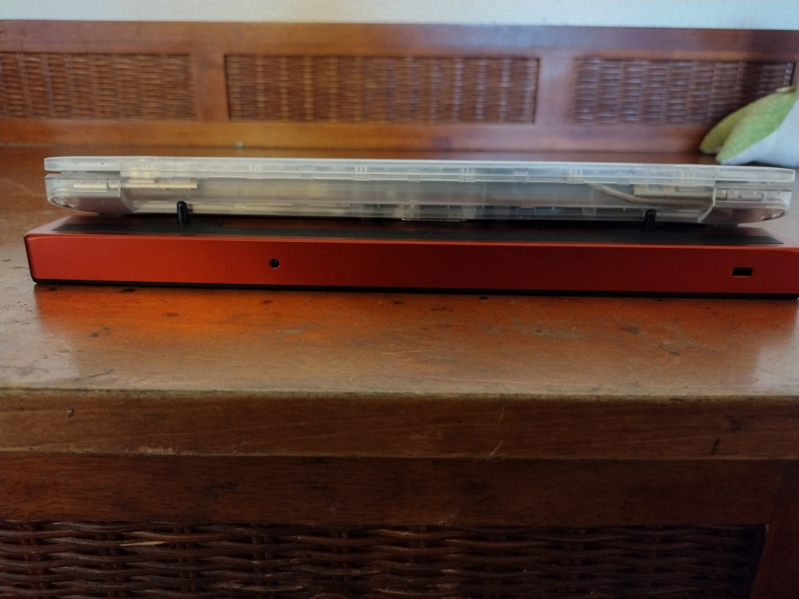

# Hardware Overview

## Prerequisites

To accomplish this process, you will need:
- WP Securebook
- Docking Station (Red or Black)
- Securebook Charger

---

## Docking Station Evaluation

This section will cover all of the ports and functions of both the Black (USB) Docking Station and the Red (Wi-Fi) Docking Station.

### Black (USB) Docking Station

The USB Docking Station is for when you need to connect your Securebook to a USB, Ethernet, or HDMI connection. Additionally, the docking station has a charging port, perminant placement screw mounts, and a Kensington port lock. 

---

---

When connecting to a Securebook, the securebook is placed snug against the dock with the dock's protruding connector securely placed inside the Securebook's docking port on the bottom.

---

---

When a powered on securebook is properly docked, a green LED light will show on the side of the Docking Station.

---

---

When a securebook is improperly docked or the Docking Station has the charger plugged into it without the securebook being docked, a red LED light will show on the side of the Docking Station.

---

---

### Red (Wi-Fi) Docking Station

The Wi-Fi Docking Station is for when you need to connect your Securebook to a wireless network. Additionally, the docking station has a charging port, perminant placement screw mounts, and a Kensington port lock.

---

---

When connecting to a Securebook, the securebook is placed snug against the dock with the dock's protruding connector securely placed inside the Securebook's docking port on the bottom.

---

---

When a powered on securebook is properly docked, a green LED light will show on the side of the Docking Station.

---

---

When a securebook is improperly docked or the Docking Station has the charger plugged into it without the securebook being docked, a red LED light will show on the side of the Docking Station.

---

---