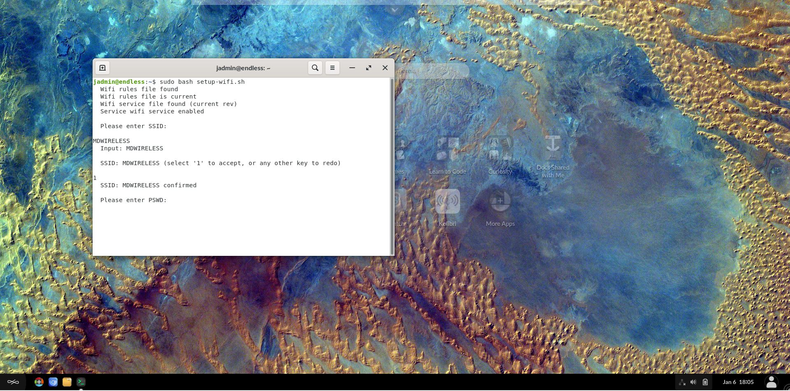

# How to run setup_wifi.sh

## Prerequisites

To accomplish this process, you will need:
- WP Securebook
- Red (Wi-Fi) Docking Station
- Wireless Network SSID and Password

---

To run the setup_wifi.sh script and get connected to a wireless network, follow these steps:
1. Dock the Securebook to the Red Docking Station
2. Make sure to be in range of the Wireless Network
3. Power On the Securebook
4. Log in to the jadmin account
5. Open the Terminal Application (Click Icon on the Desktop or Type 'Terminal' in the Searchbar)

---

---

6. Run the following command:
	`sudo bash setup_wifi.sh`
7. Follow the On-Screen prompts:
> - Type the SSID of the Wireless Network
> - Press Enter
> - Type 1
> - Press Enter

---

---

> - Type the Password of the Wireless Network
> - Press Enter
> - Type 1
> - Press Enter

---

---

*Note: Once you have entered all the information, the script should conclude.*

8. Once the script concludes, close the Terminal Application.

---

*Note: If the script is run out of range of the wireless network then the Securebook will need to be Powered Off then On again when in range to complete the process.*

In the event that information is incorrect when entered, was incorrectly entered or changed at a later date, Power Off the Securebook and repeat this process from step 1 with the new and/or correct information.