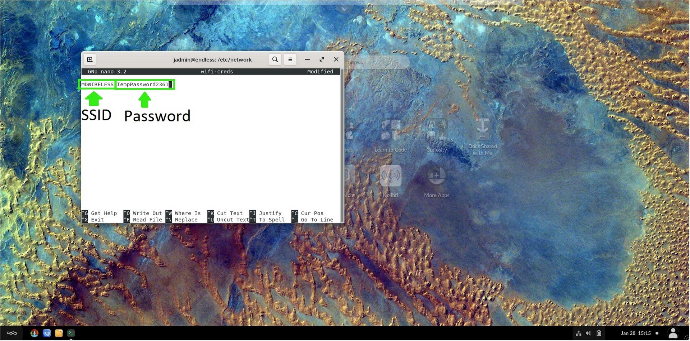
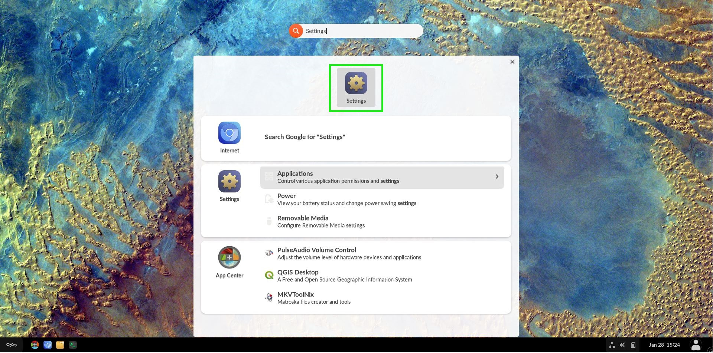
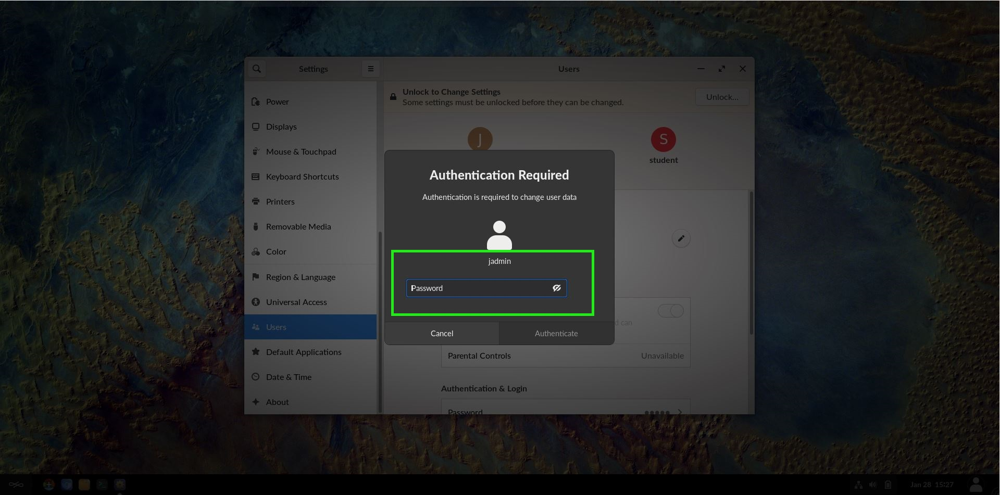
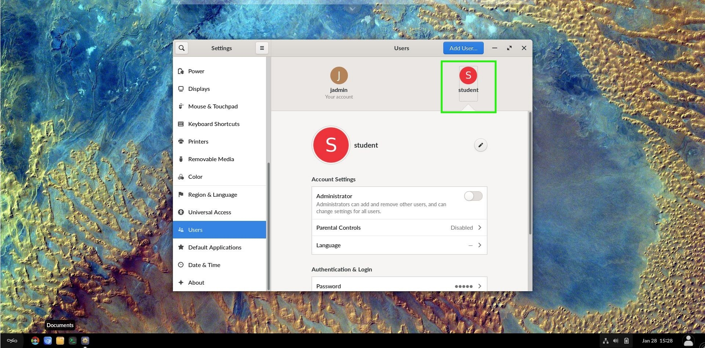
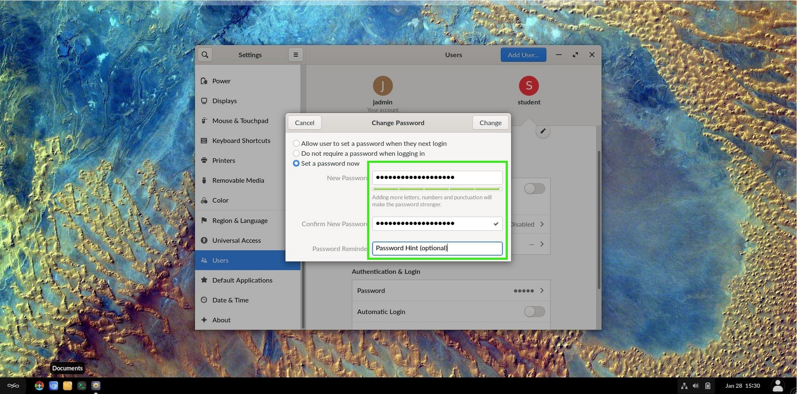

# Advanced Technical Tutorials

These guides are more advanced and should be followed with caution

## Prerequisites

To accomplish these processes, you will need:
- WP Securebook
- Red (Wi-Fi) Docking Station (Optional)

---

## Accessing Terminal as jadmin

1. Turn on the Securebook
2. Log into jadmin profile

---

---

3. Start the Terminal Application

---

---

## Changing Wi-Fi Credentials

1. Dock the Securebook to the WiFi Docking Station. (Optional)
2. Access the terminal as jadmin
3. Enter the following commands:
`cd /etc/NetworkManager/system-connection/`
4. Now search for network connections:
`ls`
5. Now delete the .nmconnection file that has the SSID of the network whos credentials you wish to change (example: If the SSID were WiFiUnitB then the file you want to delete would be WiFiUnitB.nmconnection):
`sudo rm -r SSID.nmconnection`
6. Now navigate to the wifi-creds file location:
`cd /etc/network/`
7. Now open the editor on the wifi-creds file:
`sudo nano wifi-creds`
8. The file will have two variables seperated by an empty space, the first being the SSID and the second being the password, edit the file to contain the updated credentials.

---

---

9. When ready to save the file, press CTL + x, y, then press enter.
10. Close the terminal application.
11. Restart the securebook.

The wifi credentials should be completely updated now.

---

## Changing Student Account Password

1. Login with the jadmin account
2. Type "Settings" in the Universal Search Bar at the top of the desktop

---

---

3. Click the gear icon that appears to open the settings window

---

---

4. Scroll until you see Users option

---

---

5. Select the Users setting

---

---

6. Click the Unlock button

---

---

7. Enter jadmin credentials

---

---

8. Select the user whose password you want to change

---

---

9. Click on the password option

---

---

10. Make sure the "Set a password now" radio button is selected

---

---

11. Enter the new password in both the new and confirm field
12. Enter a password hint if desided

---

---

13. Click the save button.
14. Close the settings menu

---