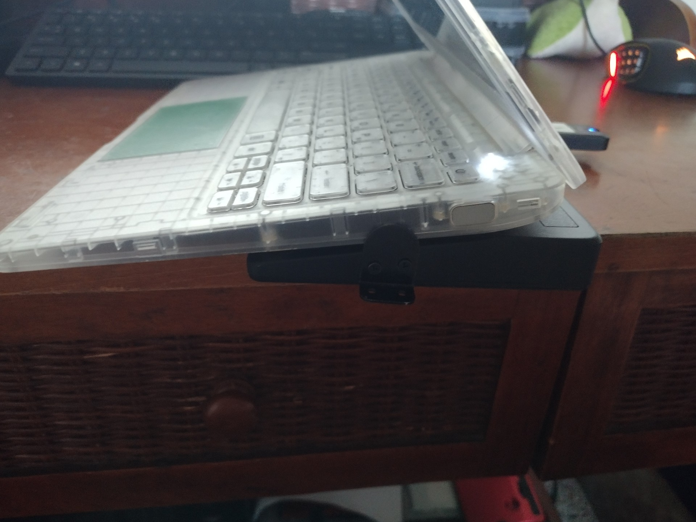
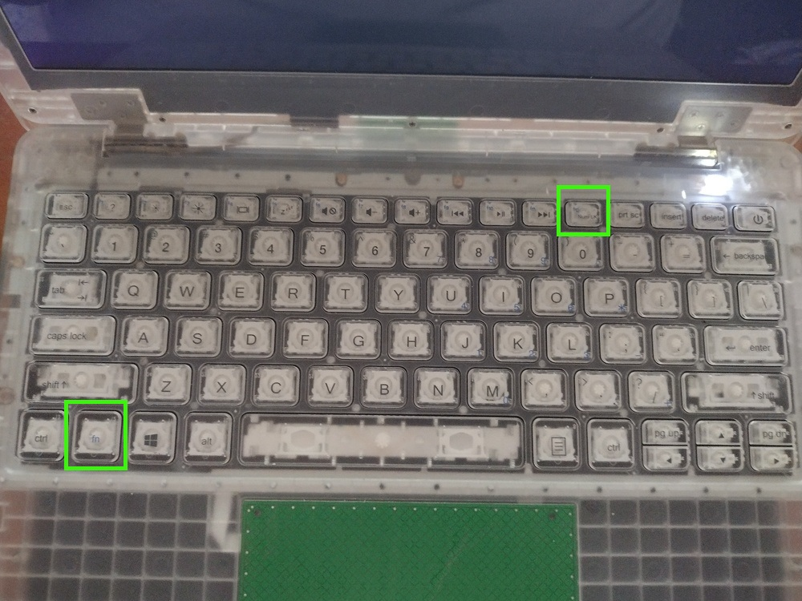
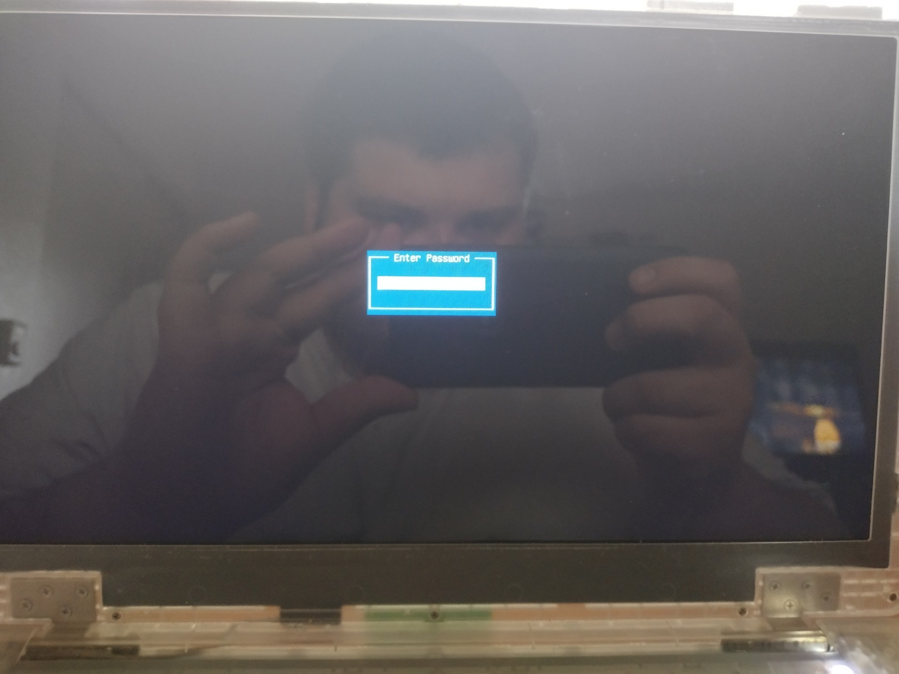
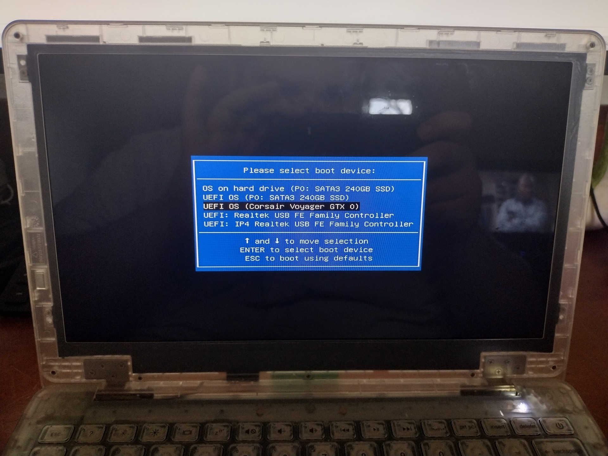

# How to Install Image With USB

## Prerequisites

To accomplish the task, you will need:
 - WP Securebook
 - Black (USB) Docking Station
 - USB Device with image

---

To Install a new image from USB to Securebook, follow these steps:
1. Make sure the securebook is powered off
2. Dock the securebook to a black docking station

---

---

3. Plug in the Image USB

---

---

4. Power on the Securebook
5. When the America Megatrends logo displays, hold the fn key and press f12 repeatedly until the Boot Order Menu Password appears

---

---

6. Enter the BIOS Password and hit enter

---

---

7. Navigate to and select the USB Device

---

---

Now the image will begin it's process of imaging to the securebook. This may take a couple hours but should automatically shutdown when it has completed.