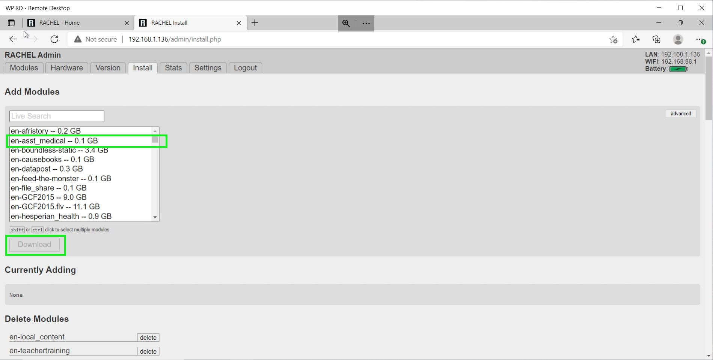
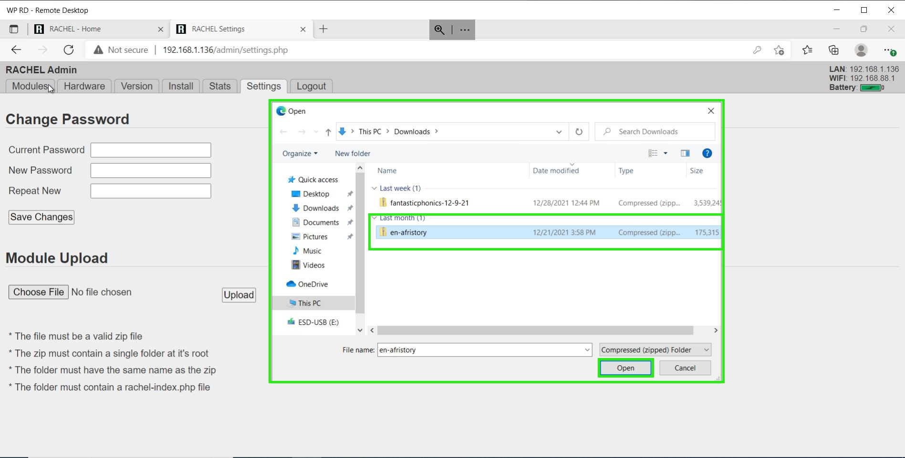

# Adding and Deleting Modules

## Prerequisites

- WP Securebook
- RACHEL Device
- Red (Wi-Fi) Docking Station
- RACHEL Admin Credentials

---

## Installing Modules

To install new modules on RACHEL, follow these steps:
1. Connect to RACHEL as Admin
2. Click on the "Install" Tab

---

---

3. Click the Module you want to Install and Press the Download Button

---

---

Once that Module finishes downloading, it is available on the RACHEL Homepage to use.

---

## Deleting Modules

To Delete existing modules from RACHEL, follow these steps:
1. Connect to RACHEL as Admin
2. Click on the "Install" Tab

---

---

3. Scroll Down the page a little bit and you will see a section called Delete Modules that lists all of the currently installed modules on RAHCEL. 
4. Click the "delete" button next to the name of a specific module to remove it completely from RACHEL.

---

---

## Installing Modules from Zip Files

*Note: RACHEL Zip Module Files can be found on the [RACHEL Website](https://rachel.worldpossible.org/). This is a great resource because modules can be downloaded from the internet and then stored on USB devices to be installed in areas or places that don't have access to the internet*

To install new modules from Zip Files on RACHEL, follow these steps:
1. Connect to RACHEL as Admin
2. Click on the "Settings" Tab

---

---

3. Click on the Choose File Button

---

---

4. Select the Zip Module File from the File Explorer

---

---

The file will now upload to RACHEL, shown by the progress bar where the Choose File button was located.

---

---

Once that Module finishes Downloading, it is available on the RACHEL homepage to use.

---
