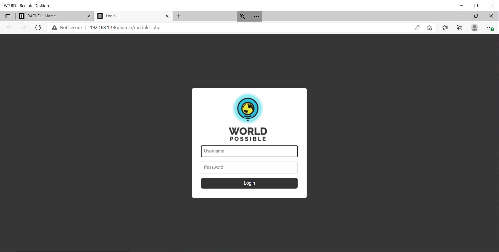

# Connect To RACHEL

## Prerequisites

- WP Securebook
- RACHEL Device
- Red (Wi-Fi) Docking Station
- RACHEL Admin Credentials

---

To connect to your RACHEL-Plus device, follow these steps:
1. Dock the Securebook to the Red Docking Station

---

---

2. Make sure to be in range of the RACHEL Wireless Network
3. Power On the Securebook

---

---

4. Log in to the jadmin account

---

---

5. Open a Web Browser Application (Chrome or Chromium should work)
6. Navigate to RACHEL by entering 192.168.88.1 in the browser addressbar.

---

---

7. Click on the "Admin" button on the top right

---

---

8. Enter the RACHEL Admin Username and Password

---

---
