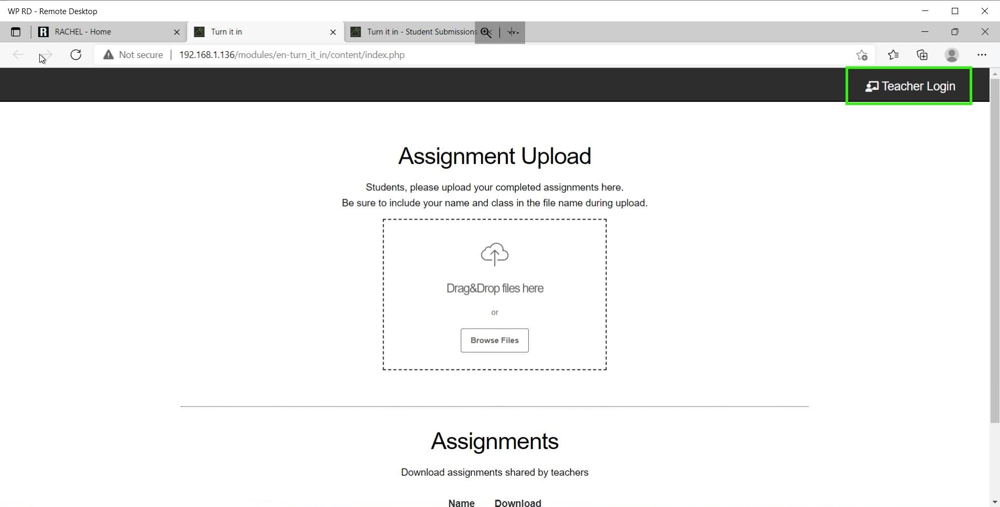

# How to use Turn It In!

## Prerequisites

To accomplish this process, you will need:
- WP Securebook
- Red (Wi-Fi) Securebook Docking Station
- Turn It In! Teacher Credentials

---

Turn It In! is a RACHEL module that allows teachers to upload content that can be downloaded by students and it also allows students to upload files for the teacher to collect.

---

## Accessing Turn It In! as Teacher

1. Power On the Securebook with it Docked on a Red Docking Station
2. Log into the jadmin account
3. Open a Web Browser Application (Chrome or Chromium should work)
4. Navigate to RACHEL
5. Select the Turn It In! Module

---

---

6. Click the "Teacher Login" button in the top right

---

---

7. Enter the Teacher Name and Password and click the Log In Button

---

---

## Accessing Turn It In! as Student

1. Power On the Securebook with it Docked on a Red Docking Station
2. Log into a student account
3. Open a Web Browser Application (Chrome or Chromium should work)
4. Navigate to RACHEL
5. Select the Turn It In! Module

---

---

## Uploading Assignments As Teacher

[Link to TII_UploadingAssignmentsAsTeacher]

---

## Downloading Submitted Assignments

[Link to TII_DownloadingSubmittedAssignments]

---

## Change Login Password

[Link to TII_ChangingLoginPassword]

---

## Uploading Assignments As Student

[Link to TII_UploadingAssignmentsAsStudent]

---

## Downloading Assignments As Student

[Link to TII_DownloadingAssignmentsAsStudent]

---
