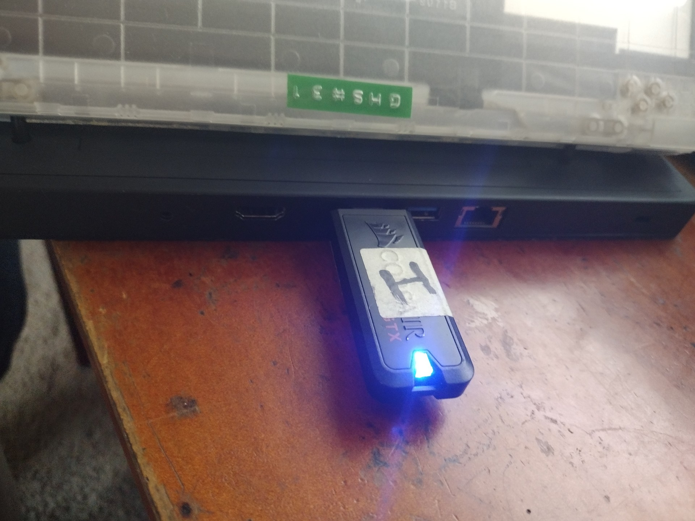
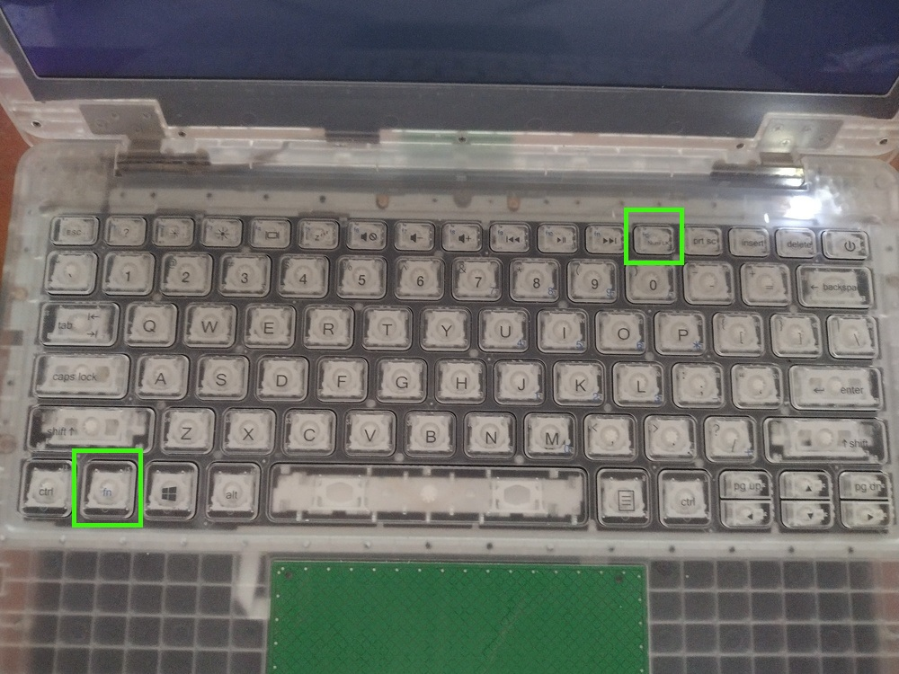

# Installing New Image With Recovery USB

## Prerequisites

To accomplish this process, you will need:
- WP Securebook
- Black (USB) Docking Station
- WP Recovery USB
- Securebook Charger

---

To install a new image to a Securebook using a Recovery USB, follow these steps:
1. Power down the Securebook
2. Plug in the Securebook Charging Cable
3. Dock the Securebook onto a black (USB) Docking Station

---

---

4. Plug the Recovery USB into the Docking Station

---

---

5. Turn on the Securebook
6. Hold the Fn key and repeatedly press F12 to being up the BIOS password input

---

---

7. Enter the BIOS Password

---

---

8. Navigate to and select the Recovery USB from the list provided

---

---

9. Allow the image to run until conclusion.