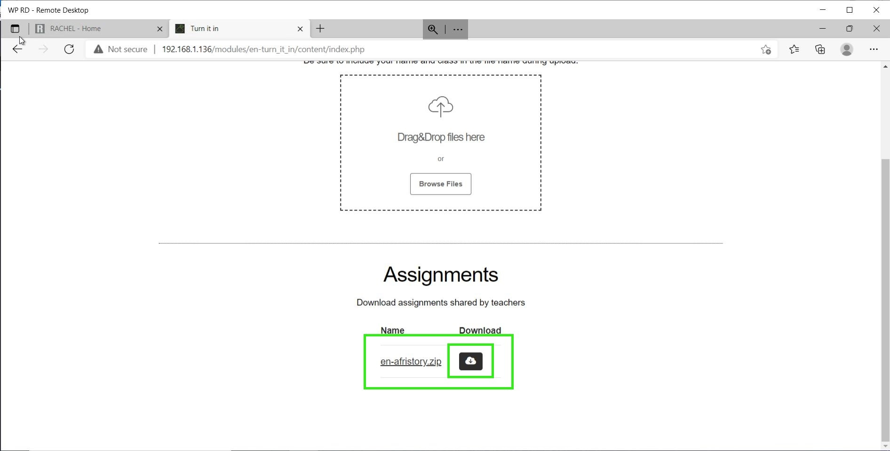

# Downloading Assignments As Student

## Prerequisites

To accomplish this process, you will need:
- WP Securebook
- Red (Wi-Fi) Securebook Docking Station

---

To download any Assignments the Teacher has posted on Turn It In!, follow these steps:
1. Access Turn It In! as a Student
2. At the bottom of the Turn It In! Homepage there is Assignments section that will list all of the Assignments currently made available by the Teacher. Click the download button next to an Assignment's name to begin downloading that Assignment.

---

---

Once the download is finished the Assignment should be ready for you to view and edit wherever your downloads are stored.

---