# Endless Superguide

## Table of Contents

1. RACHEL-Plus
2. Turn It In!
3. Hardware Overview
4. WP Scripts
5. Kolibri Studio
6. Browser
7. Advanced Technical

---

## RACHEL-plus Guide

### Connect To RACHEL

#### Prerequisites

- WP Securebook
- RACHEL Device
- Red (Wi-Fi) Docking Station
- RACHEL Admin Credentials

---

To connect to your RACHEL-Plus device, follow these steps:
1. Dock the Securebook to the Red Docking Station

---

---

2. Make sure to be in range of the RACHEL Wireless Network
3. Power On the Securebook

---

---

4. Log in to the jadmin account

---

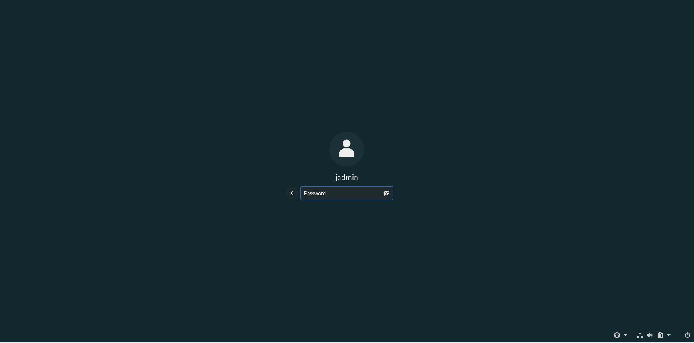

---

5. Open a Web Browser Application (Chrome or Chromium should work)
6. Navigate to RACHEL by entering 192.168.88.1 in the browser addressbar.

---

---

7. Click on the "Admin" button on the top right

---

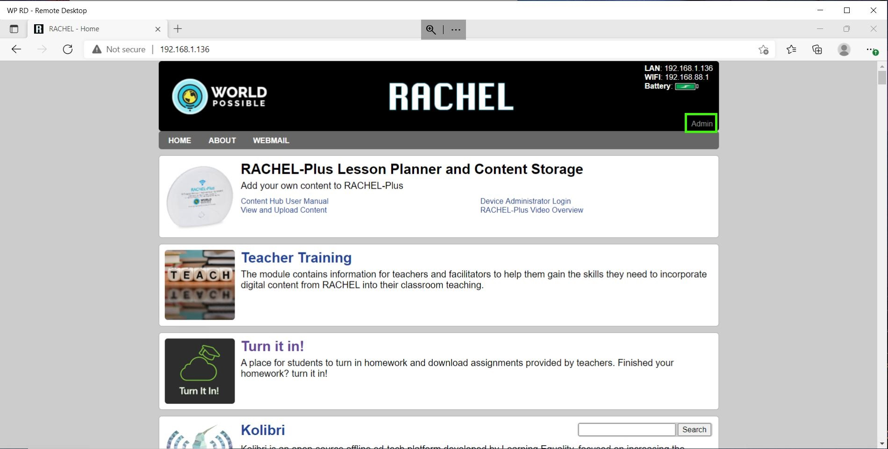

---

8. Enter the RACHEL Admin Username and Password

---

---

### Adding and Deleting Modules

#### Prerequisites

- WP Securebook
- RACHEL Device
- Red (Wi-Fi) Docking Station
- RACHEL Admin Credentials

---

#### Installing Modules

To install new modules on RACHEL, follow these steps:
1. Connect to RACHEL as Admin
2. Click on the "Install" Tab

---

---

3. Click the Module you want to Install and Press the Download Button

---

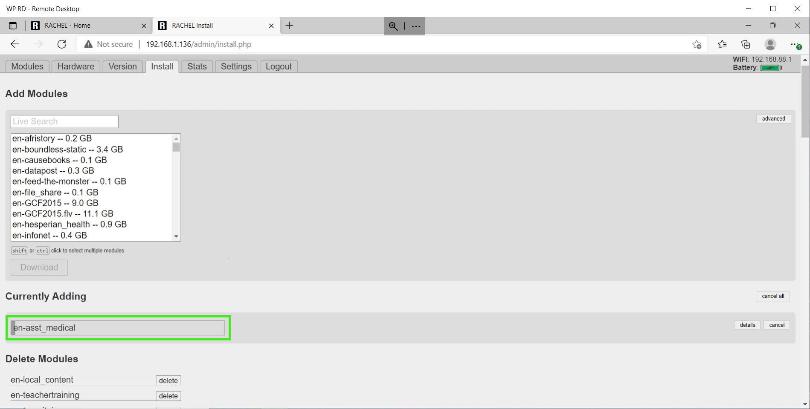

---

Once that Module finishes downloading, it is available on the RACHEL Homepage to use.

---

#### Deleting Modules

To Delete existing modules from RACHEL, follow these steps:
1. Connect to RACHEL as Admin
2. Click on the "Install" Tab

---

---

3. Scroll Down the page a little bit and you will see a section called Delete Modules that lists all of the currently installed modules on RAHCEL. 
4. Click the "delete" button next to the name of a specific module to remove it completely from RACHEL.

---

---

#### Installing Modules from Zip Files

*Note: RACHEL Zip Module Files can be found on the [RACHEL Website](https://rachel.worldpossible.org/). This is a great resource because modules can be downloaded from the internet and then stored on USB devices to be installed in areas or places that don't have access to the internet*

To install new modules from Zip Files on RACHEL, follow these steps:
1. Connect to RACHEL as Admin
2. Click on the "Settings" Tab

---

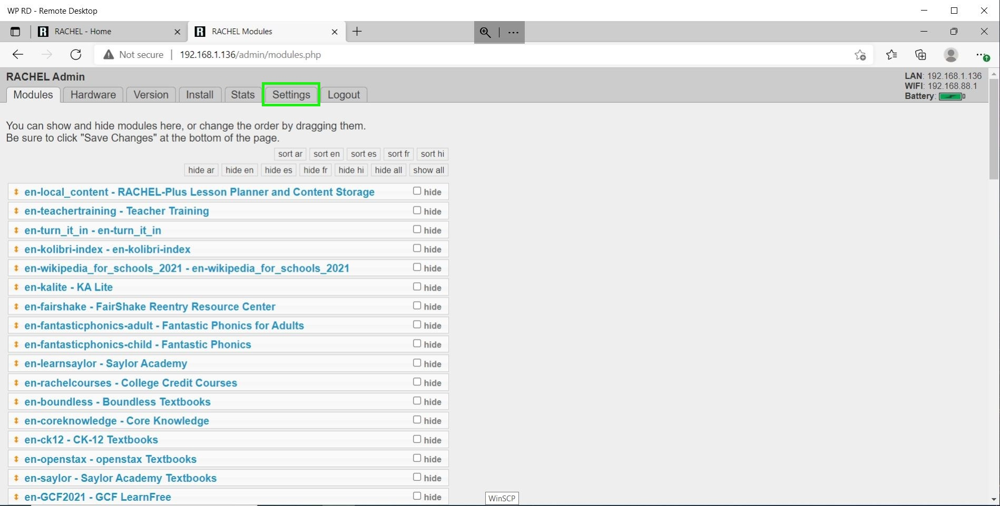

---

3. Click on the Choose File Button

---

---

4. Select the Zip Module File from the File Explorer

---

---

The file will now upload to RACHEL, shown by the progress bar where the Choose File button was located.

---

---

Once that Module finishes Downloading, it is available on the RACHEL homepage to use.

---

### Hiding and Sorting Modules

#### Prerequisites

- WP Securebook
- RACHEL Device
- Red (Wi-Fi) Docking Station
- RACHEL Admin Credentials

---

#### Hiding Modules

To hide existing modules in RACHEL, follow these steps:
1. Connect to RACHEL as Admin
2. Click on the Modules Tab (If you are not already there)

---

---

3. To hide an existing module, click on the checkbox to the right of the module's name, next the the word "hide". Additionally, there are Hiding Tags by language at the top that can hide/show modules by language.
*Note: Similarly, to unhide a module, uncheck the box next to that module's name.*

---

*Note: This will not remove the module from RACHEL, but instead hide it and make it unavailable to the user.*

---

4. Scroll to the bottom of the page and Click the "Save Changes" button.

---

#### Sorting Modules

To sort existing modules in RACHEL, follow these steps:
1. Connect to RACHEL as Admin
2. Click on the Modules Tab (If you are not already there)

---

---

3. On top of the listed modules are Sorting Tags by language, Clicking on any of these will sort the list of existing RACHEL modules which also changes how they are displayed on the RACHEL Homepage.
*Note: Modules can also be reordered in the list manually by dragging and dropping them into chosen places.*

---

---

4. Scroll to the bottom of the page and Click the "Save Changes" button.

---

### Rachel Power Guide

#### Prerequisites

- WP Securebook
- RACHEL Device
- Red (Wi-Fi) Docking Station
- RACHEL Admin Credentials

---

#### Powering on Your RACHEL-Plus

1. To safely power on the RACHEL-Plus device, please press the the Power button on the top for 5 seconds. Release when you see the blue lights

---

---

2. With the blue lights visible, your RACHEL-Plus is now powered on

---

---

#### Powering off Your RACHEL-Plus

1. To safely turn off the RACHEL-Plus device, please press the the Power button once, then release.

---

---

2. Once the blue lights turn off, your RACHEL-Plus is powered off

---

---

#### Maintaining your RACHEL-Plus' Battery

- Unless you plan to use this device on battery power as your standard method of operation, the battery should be removed
- The device should not remain plugged in for more than 24 hours at any point in time unless the battery has been removed
- If you're using the device on battery power, always remember to unplug the charger when charging completes

---

## Turn It In! Guide

### Prerequisites

To accomplish this process, you will need:
- WP Securebook
- Red (Wi-Fi) Securebook Docking Station
- Turn It In! Teacher Credentials

---

Turn It In! is a RACHEL module that allows teachers to upload content that can be downloaded by students and it also allows students to upload files for the teacher to collect.

---

### Accessing Turn It In! as Teacher

1. Power On the Securebook with it Docked on a Red Docking Station
2. Log into the jadmin account
3. Open a Web Browser Application (Chrome or Chromium should work)
4. Navigate to RACHEL
5. Select the Turn It In! Module

---

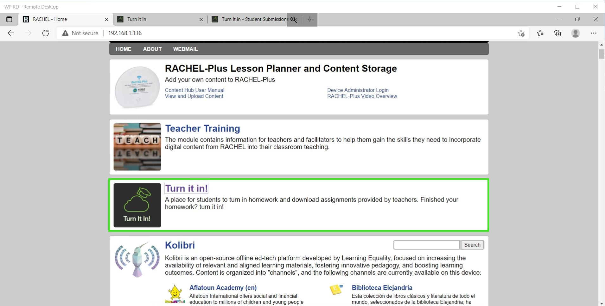

---

6. Click the "Teacher Login" button in the top right

---

---

7. Enter the Teacher Name and Password and click the Log In Button

---

---

### Accessing Turn It In! as Student

1. Power On the Securebook with it Docked on a Red Docking Station
2. Log into a student account
3. Open a Web Browser Application (Chrome or Chromium should work)
4. Navigate to RACHEL
5. Select the Turn It In! Module

---

---

### Uploading Assignments as Teacher

#### Prerequisites

To accomplish this process, you will need:
- WP Securebook
- Red (Wi-Fi) Securebook Docking Station
- Turn It In! Teacher Credentials
- Assignments to Upload

---

To upload a file to Turn It In!, follow these steps:
1. Log into Turn It In! as Teacher
2. Click on the "Available To All" button in the top right

---

---

3. To Upload a file, Drag and Drop the file into the dotted box or click the "Browse Files" button and select the file from the File Explorer.

---

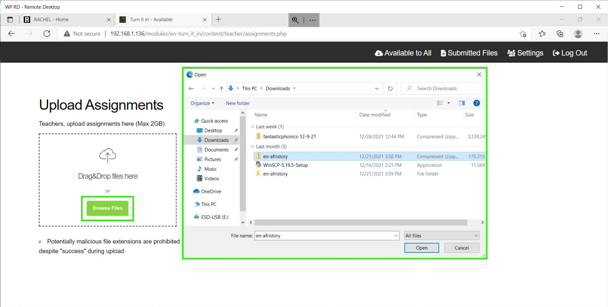

---

4. When the file is done uploading to Turn It In! it will appear in the Available to All section and will now be accessible for all students to download.

---

---

Repeat this process for all files that you wish for students to be able to access and download from Turn It In!

---

### Downloading Submitted Assignments

#### Prerequisites

To accomplish this process, you will need:
- WP Securebook
- Red (Wi-Fi) Securebook Docking Station
- Turn It In! Teacher Credentials

---

To download student submissions from Turn It In!, follow these steps:
1. Log into Turn It In! as Teacher
2. To download a file that a student has submitted, click the download button to the right of the file's name, size, and modified date.

---

*Note: Clicking the trashcan icon next to the download button will delete the file from Turn It In!*

---

3. Alternatively, to download all the files that students have submitted, click and check the checkbox on the All Files option then click the All Files download button.

---

*Note: Clicking the trashcan icon next to the download button will delete all the files from Turn It In!*

---

Once the file finishes downloading, it should be available for you to view and edit wherever your downloads are saved. If you downloaded the files using the All Files option then the files will be compressed into a zip folder before downloading and will need to be unzipped before you are able to view and edit them.

---

### Changing Login Password

#### Prerequisites

To accomplish this process, you will need:
- WP Securebook
- Red (Wi-Fi) Securebook Docking Station
- Turn It In! Teacher Credentials
- Teacher's New Password

---

To change your password as a Teacher on Turn It In!, follow these steps:
1. Log into Turn It In! as Teacher
2. Click the "Settings" button in the top right

---

---

3. Enter the Old Password, and then the new password in both the New Password and Confirm Password fields.

---

---

4. Press the Submit button at the bottom and the password will be successfully changed.

---

### Downloading Assignments As Student

#### Prerequisites

To accomplish this process, you will need:
- WP Securebook
- Red (Wi-Fi) Securebook Docking Station

---

To download any Assignments the Teacher has posted on Turn It In!, follow these steps:
1. Access Turn It In! as a Student
2. At the bottom of the Turn It In! Homepage there is Assignments section that will list all of the Assignments currently made available by the Teacher. Click the download button next to an Assignment's name to begin downloading that Assignment.

---

---

Once the download is finished the Assignment should be ready for you to view and edit wherever your downloads are stored.

---
### Uploading Assignments as Student

#### Prerequisites

To accomplish this process, you will need:
- WP Securebook
- Red (Wi-Fi) Securebook Docking Station
- Assignments to Upload

---

To upload Assignments to the teacher on Turn It In!, follow these steps:
1. Access Turn It In! as a Student
2. To Upload a file, Drag and Drop the file into the dotted box or click the "Browse Files" button and select the file from the File Explorer.

---

---

3.  Once the files have finished uploading they will be available for the teacher to download and review. *Note: Once a file is submitted on Turn It In! it can only be deleted from Turn It In! by the Teacher.*

---

---

## Hardware Guide

### Prerequisites

To accomplish this process, you will need:
- WP Securebook
- Docking Station (Red or Black)
- Securebook Charger

---

### Docking Station Evaluation

This section will cover all of the ports and functions of both the Black (USB) Docking Station and the Red (Wi-Fi) Docking Station.

#### Black (USB) Docking Station

The USB Docking Station is for when you need to connect your Securebook to a USB, Ethernet, or HDMI connection. Additionally, the docking station has a charging port, perminant placement screw mounts, and a Kensington port lock. 

---

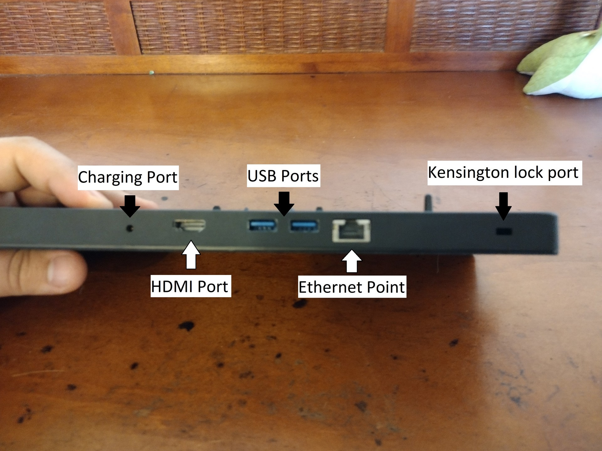

---

When connecting to a Securebook, the securebook is placed snug against the dock with the dock's protruding connector securely placed inside the Securebook's docking port on the bottom.

---

---

When a powered on securebook is properly docked, a green LED light will show on the side of the Docking Station.

---

---

When a securebook is improperly docked or the Docking Station has the charger plugged into it without the securebook being docked, a red LED light will show on the side of the Docking Station.

---

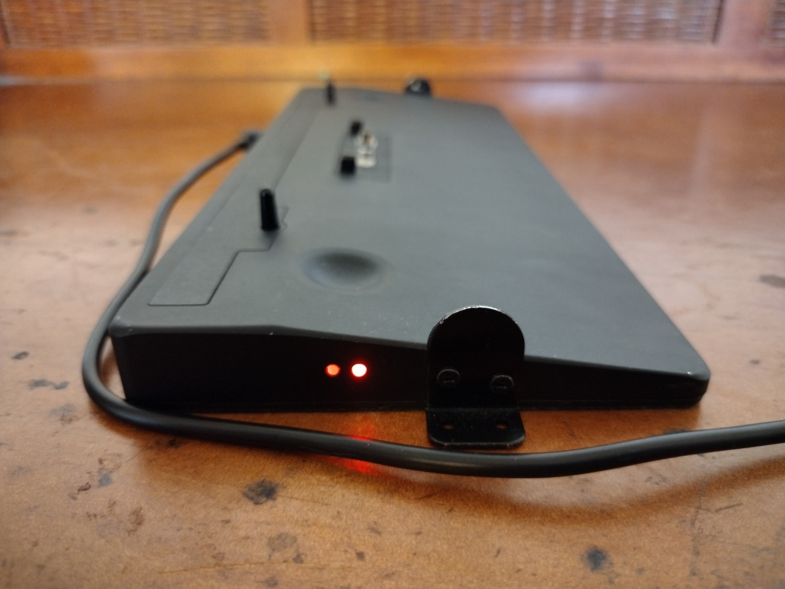

---

### Red (Wi-Fi) Docking Station

The Wi-Fi Docking Station is for when you need to connect your Securebook to a wireless network. Additionally, the docking station has a charging port, perminant placement screw mounts, and a Kensington port lock.

---

---

When connecting to a Securebook, the securebook is placed snug against the dock with the dock's protruding connector securely placed inside the Securebook's docking port on the bottom.

---

---

When a powered on securebook is properly docked, a green LED light will show on the side of the Docking Station.

---

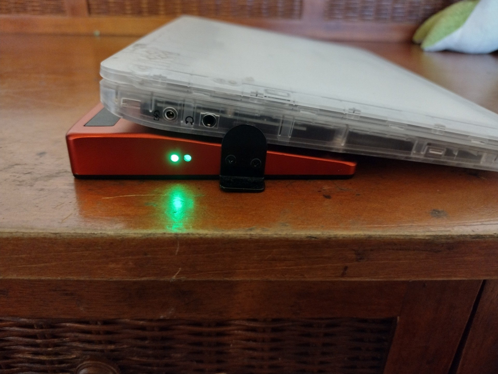

---

When a securebook is improperly docked or the Docking Station has the charger plugged into it without the securebook being docked, a red LED light will show on the side of the Docking Station.

---

---

### Black (USB) Docking Station

#### How to Dock Devices to USB

##### Prerequisites
To accomplish this process, you will need:
 - WP Securebook
 - Black (USB) Securebook Docking Station
 - USB Device

---

To Access a USB devices with a Securebook, follow these steps:
1. Power Off the Securebook
2. Dock the Securebook onto the Black Docking Station

---

*Note: If the Securebook is correctly situated on the docking station, A green light will light up on the side. If there is no light, the Securebook could be improperly mounted, powered off, or even be dead (0% power).*

---

3. Power On the Securebook
4. Log in to an account
5. Plug the desired USB device into the Black USB Dock

---

---

6. Open the Document Explorer
7. Select the USB device from the pane on the left

---

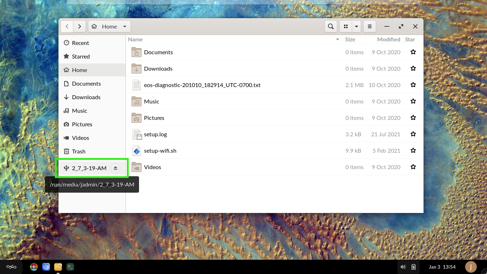

---

Users are not limited to using a singular Black Docking Station. Should the need arise, the user can repeat the steps above on an entirely different Black Docking Station and achieve the same results.
*Note*: For best results, make sure the Securebook is Turned Off when docking to a Black Docking Station.

---

### Red (Wi-Fi) Docking Station

#### How to Dock Devices to Wi-Fi

##### Prerequisites

To accomplish this process, you will need:
 - WP Securebook
 - Red (Wi-Fi) Securebook Docking Station

---

To Access a Wireless Network with a Securebook, follow these steps:
1. Power Off the Securebook
2. Dock the Securebook onto the Red Docking Station

---

*Note: If the Securebook is correctly situated on the docking station, A green light will light up on the side. If there is no light, the Securebook could be improperly mounted, powered off, or even be dead (0% power).*

---

3. Power On the Securebook
4. Log in to an account

---

The Endless OS Justice Michigan Image has the Wi-Fi connection to RACHEL preconfigured, meaning that no additional steps are need to access the RACHEL device, given that the Securebook is Docked and in range of the RACHEL device.
Users are not limited to using a singular Red Docking Station. Should the need arise, the user can repeat the steps above on an entirely different Red Docking Station and achieve the same results.
*Note*: For best results, make sure the Securebook is Turned Off when docking to a Red Docking Station.

---

### Hardware Overview Graphic

---

### Installing New Image with Recovery USB

#### Installing New Image With Recovery USB

##### Prerequisites

To accomplish this process, you will need:
- WP Securebook
- Black (USB) Docking Station
- WP Recovery USB
- Securebook Charger

---

To install a new image to a Securebook using a Recovery USB, follow these steps:
1. Power down the Securebook
2. Plug in the Securebook Charging Cable
3. Dock the Securebook onto a black (USB) Docking Station

---

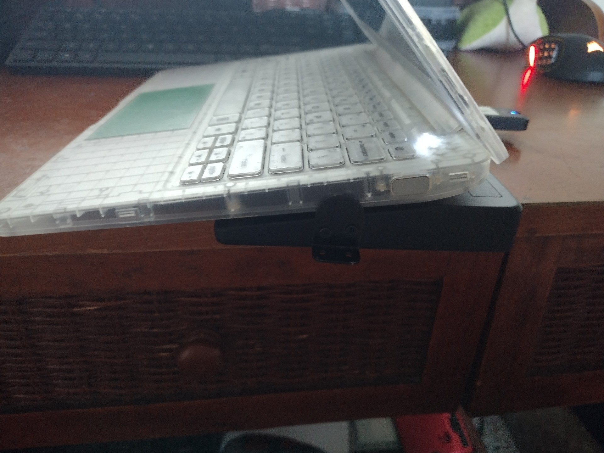

---

4. Plug the Recovery USB into the Docking Station

---

---

5. Turn on the Securebook
6. Hold the Fn key and repeatedly press F12 to being up the BIOS password input

---

---

7. Enter the BIOS Password

---

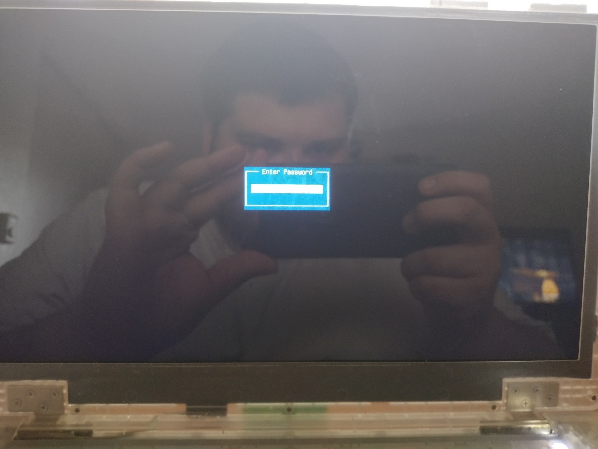

---

8. Navigate to and select the Recovery USB from the list provided

---

---

9. Allow the image to run until conclusion.

---

## WP Script Guides

### How to run first_setup.sh

#### Prerequisites

To accomplish this process you will need:
- WP Securebook
- Default jadmin Password
- New Student's Name and Password
- New jadmin Password
- Current Date and Time

*Note: Double Check all information entered during this script as it should only be run once.* 

---

To complete the First Setup process, follow these steps:

1. Power On the Securebook
2. Login to the jadmin account using the default password
3. Open the Terminal Application (Click Icon on the Desktop or Type 'Terminal' in the Searchbar)

---

---

4. Run the following command:
	`sudo bash first_setup.sh`
5. Follow the On-Screen prompts:
> - Enter the New Student Account Name
> - Enter the New Student Account Password

---

---

> - Enter the New jadmin Account Password

---

---

> - Enter the Current Date (YYYYMMDD)
> - Enter the Current Time (HH:MM) in 24 Hour format

---

---

*Note: Once you have entered all the information, the script should conclude.*

6. Once the script concludes, close the Terminal Application.

---

In the event that information is incorrect when entered or was incorrectly entered, refer to the Changing Setup Values Document for more details on methods and commands to use to correct the information mis-entered.

---
### How to run setup_wifi.sh

#### Prerequisites

To accomplish this process, you will need:
- WP Securebook
- Red (Wi-Fi) Docking Station
- Wireless Network SSID and Password

---

To run the setup_wifi.sh script and get connected to a wireless network, follow these steps:
1. Dock the Securebook to the Red Docking Station
2. Make sure to be in range of the Wireless Network
3. Power On the Securebook
4. Log in to the jadmin account
5. Open the Terminal Application (Click Icon on the Desktop or Type 'Terminal' in the Searchbar)

---

---

6. Run the following command:
	`sudo bash setup_wifi.sh`
7. Follow the On-Screen prompts:
> - Type the SSID of the Wireless Network
> - Press Enter
> - Type 1
> - Press Enter

---

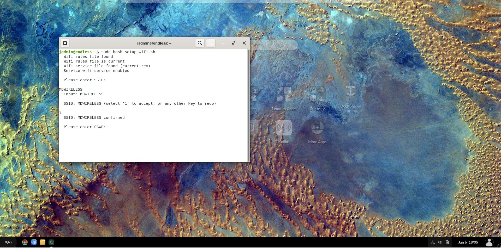

---

> - Type the Password of the Wireless Network
> - Press Enter
> - Type 1
> - Press Enter

---

---

*Note: Once you have entered all the information, the script should conclude.*

8. Once the script concludes, close the Terminal Application.

---

*Note: If the script is run out of range of the wireless network then the Securebook will need to be Powered Off then On again when in range to complete the process.*

In the event that information is incorrect when entered, was incorrectly entered or changed at a later date, Power Off the Securebook and repeat this process from step 1 with the new and/or correct information.

---

## Kolirbi Guides

---

### What is Kolibri and Channel Making

For the best documentation on using Kolibri, follow some of the links below:

#### Kolibri Studio Link

https://studio.learningequality.org/en/accounts/#/

#### Kolibri Studio User Guide

https://kolibri-studio.readthedocs.io/en/latest/index.html

#### Kolibri Demo

https://kolibri-demo.learningequality.org/en/user/#/

#### Kolibri Studio user Guide PDF file

https://www.google.ca/url?sa=t&rct=j&q=&esrc=s&source=web&cd=&ved=2ahUKEwjNw_zrqYr1[…]nloads%2Fen%2Flatest%2Fpdf%2F&usg=AOvVaw0rAlsZ5XKIiH6tu1bIDtkM

---

### Syncing Kolibri to RACHEL using Tokens

This tutorial will guide you through importing custom made Kolibri Studio channels to Kolibei on your RACHEL-Plus device.

---

#### Prerequisites

To accomplish this process, you will need:
- A PC or Mobile device
- A Published Kolibri Studio Channel
- A supported Chrome, Chromium, or Edge browser
- A RACHEL-Plus device connected to the internet

---

#### Finding your channel token

When first publishing your channel on Kolibri Studio you will recieve and email that contains your channel token. If you can't find this token, follow this procedure to get the token again from Kolibri Studio.

1. Open your web browser, navigate to [Kolibri Studio](https://studio.learningequality.org) and sign in to your account

---

---

2. Click anywhere on your custom channel to enter it

---

---

3. On the top right next to publish, click the "..."

---

---

4. Click get token

---

---

5. Press the copy button to copy your channel token

---

---

6. Your channel token can now be pasted into Kolibri for importing, or a document for saving.

---

#### Importing Your Channel to the RACHEL-Plus

These steps will cover importing your Kolibri Channel from Kolibri Studio online

1. Make sure your RACHEL-Plus device is connected to the internet via the left ethernet port

---

---

2. Turn on the RACHEL-Plus by pressing the power button on the top for 5 seconds, then releasing when the blue light turns on.

---

---

3. Using your PC or mobile device, connect to the RACHEL WIFI hotspot.
4. While connected, navigate to the address [http://192.168.88.1](192.168.88.1) in your web browser

* Please note that If your PC is connected to the same router as your RACHEL-Plus device, you can also navigate to the IP address assigned by your router to the RACHEL-Plus without connecting to the wifi.

5. On the main page of RACHEL, click the Kolibri link on the Kolibri module

---

---

6. Enter your admin username at the signin page, then click the NEXT button

---

---

7. Enter your admin password and click the SIGN IN button 

---

---

8. You should be on the channels page of Kolibri as admin user. Click the IMPORT button.

---

---

9. Select Kolibri Studio (online) as your source and press Continue

---

---

10. Click the IMPORT WITH TOKEN button

---

---

11. Enter your channel token and click CONTINUE and wait for the generating progress bar to complete

---

---

12. You will see an overview of your channel's content. Click the "Select All" checkmark to select all of your content. With everything selected, click CONTINUE.

---

---

13. Your content will now import. This process will take some time for larger channels. Once complete you will see a screen similar to the following with a completed task. 

---

---

14. Click Channels in the top navigation bar

---

---

15. Your new channel should now show on this page

---

---

You have successfully imported your custom Kolibri channel from Kolibri Studio online to your RACHEL-Plus device. The channel willl now be available for students to browse on the RACHEL-Plus or sync to their securebooks for offline use

---

### How to Sync Kolibri Channel From RACHEL (Student's Guide)

#### Prerequisites
To accomplish this process, you will need:
- WP Securebook
- Red (WiFi) Docking Station
- RACHEL Device

---

To sync the content of an updated Kolibri Channel from RACHEL, follow these steps:

1. Dock the Securebook to the Red Docking Station
2. Power On the Securebook
3. Log into a Student account
4. Click the Kolibri Application icon on the desktop to open Kolibri

---

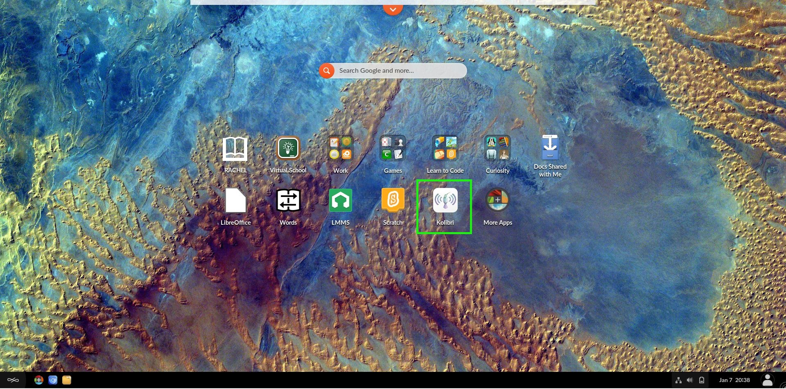

---

5. Log into the Kolibri Student Account (If Necessary)
6. Click the "Import" button

---

---

7.  Select the "Local Network or internet" option

---

---

8. Select the "RACHEL" option
9. Click the "Select Resources" button on the channel you wish to sync (We'll use Digital Library for the Example)

---

---

10. Select the "Select All" checkbox (or just the specific checkboxes for choice modules) then click the "IMPORT" button

---

---

The channel will begin downloading the new content.

---

---

Once the channel finishes downloading the new content from RACHEL it will be available in the Kolibri  Channels Tab.

---

---

## Browser Guide

### Checking Browser History

This guide will help the admin check the browser history of the student account.

#### Prerequisites

To accomplish these processes, you will need:
- WP Securebook
- Student Credentials

---

1. Power on the Securebook
2. Log into the Student account using the Student Credentials
3. Open the Web Broswer
4. Enter the following address into the address bar:
`chrome://history`

---

---

In the center of the page, below the searchbar, is the history area that will display all of the student's browser history in chronological order, newest history being at the top.

---

---

Here the student's Browser History can be viewed
Additionally, the searchbar at the top allows you to use keywords or website names to narrow your search through the saved history.

---

---

## Advanced Techincal Guides

These guides are more advanced and should be followed with caution

### Prerequisites

To accomplish these processes, you will need:
- WP Securebook
- Red (Wi-Fi) Docking Station (Optional)

---

### Accessing Terminal as jadmin

1. Turn on the Securebook
2. Log into jadmin profile

---

---

3. Start the Terminal Application

---

---

### Changing Wi-Fi Credentials

1. Dock the Securebook to the WiFi Docking Station. (Optional)
2. Access the terminal as jadmin
3. Enter the following commands:
`cd /etc/NetworkManager/system-connection/`
4. Now search for network connections:
`ls`
5. Now delete the .nmconnection file that has the SSID of the network whos credentials you wish to change (example: If the SSID were WiFiUnitB then the file you want to delete would be WiFiUnitB.nmconnection):
`sudo rm -r SSID.nmconnection`
6. Now navigate to the wifi-creds file location:
`cd /etc/network/`
7. Now open the editor on the wifi-creds file:
`sudo nano wifi-creds`
8. The file will have two variables seperated by an empty space, the first being the SSID and the second being the password, edit the file to contain the updated credentials.

---

---

9. When ready to save the file, press CTL + x, y, then press enter.
10. Close the terminal application.
11. Restart the securebook.

The wifi credentials should be completely updated now.

---

### Changing Student Account Password

1. Login with the jadmin account
2. Type "Settings" in the Universal Search Bar at the top of the desktop

---

---

3. Click the gear icon that appears to open the settings window

---

---

4. Scroll until you see Users option

---

---

5. Select the Users setting

---

---

6. Click the Unlock button

---

---

7. Enter jadmin credentials

---

---

8. Select the user whose password you want to change

---

---

9. Click on the password option

---

---

10. Make sure the "Set a password now" radio button is selected

---

---

11. Enter the new password in both the new and confirm field
12. Enter a password hint if desided

---

---

13. Click the save button.
14. Close the settings menu

---

## Deployment Specific Guides

### Washington

#### Jconfig Utility

##### Prerequisites

To accomplish this process, you will need:
- WP Securebook
- Black (USB) Docking Station
- Red (Wi-Fi) Docking Station
- USB Device
- Jconfig Utility

---

##### Run the Jconfig Utility

To use the Jconfig Utility, follow these steps:
1. Unzip this latest utility

---

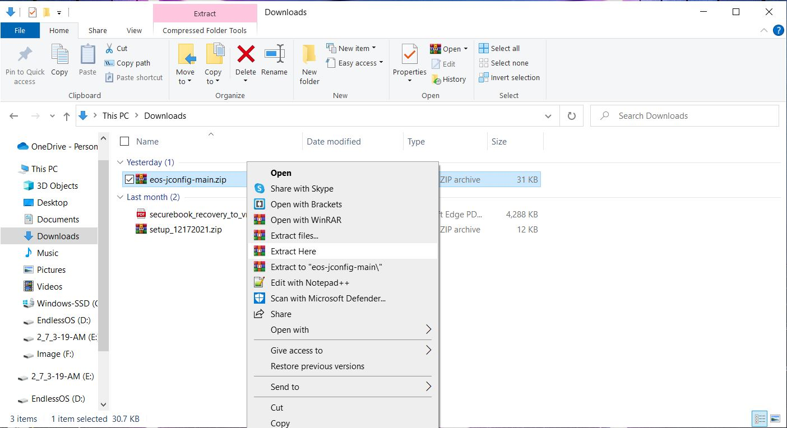

---

2. Place the files from the zip on an exFAT USB drive

---

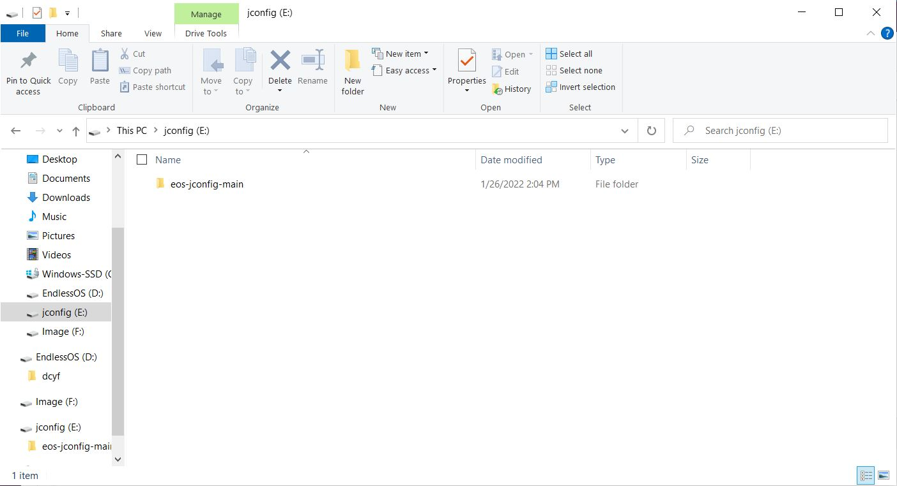

---

3. Boot the securebook with a black docking station
4. Connect the new exFAT USB stick with the new utility on it in the docking station
5. Login with the jadmin account

---

---

6. Open a terminal window

---

---

7. Open a file manager window

---

---

8. Navigate to the new USB

---

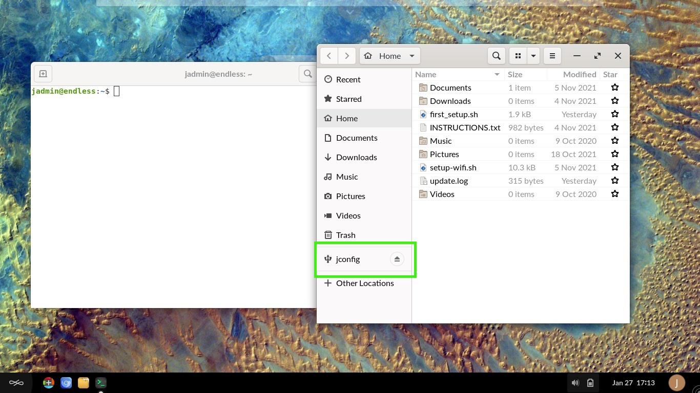

---

9. Drag "setup" onto the terminal window

---

---

10. Click the terminal window
11. Press enter with the command in place, making sure no changes were made

---

---

With access to the Jconfig Utility, you now have the ability to run the update script as well as set/change wifi credentials.

---

##### How to change wifi credentials

To use the Jconfig Utility to change wifi credentials, follow these steps:
1. Run the Jconfig Utility

---

---

2. Use the arrow key to select "Set New WIFI Credentials" and press ENTER

---

---

3. Enter the SSID, then press ENTER 

---

---

4. Enter the Password, then press ENTER

*Note: Please make sure the network password doesn't use any special characters and only a-z 0-9 characters for best results.*

---

---

5. Press enter to exit any success prompt

---

---

6. Navigate to Exit and press ENTER

---

---

7. Shut the system down
8. Dock to a red WIFI docking station
9. Be in range of the SSID
10. Turn the system on
11. Check that WIFI is properly connected

---

---

### Michigan

---

### New York

---

